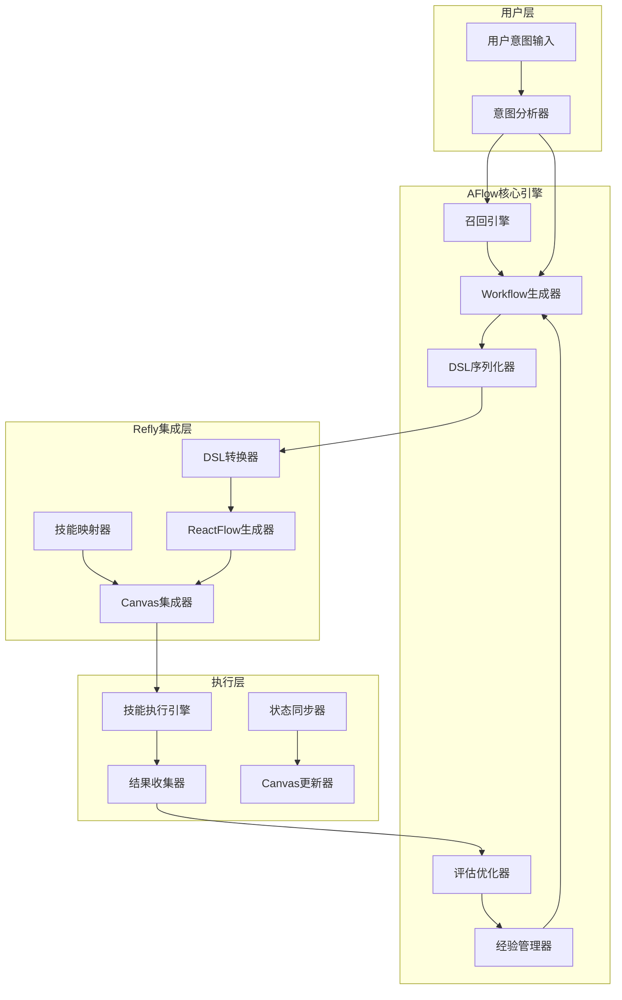

# AFlow-Based Pilot 完整设计方案

> **版本**: v1.0 Final  
> **日期**: 2025年1月  
> **状态**: 实施就绪  

## 📋 目录

- [项目概述](#项目概述)
- [核心架构设计](#核心架构设计)
- [简化DSL设计](#简化dsl设计)
- [并行错误处理策略](#并行错误处理策略)
- [技术实现方案](#技术实现方案)
- [实施计划](#实施计划)
- [验收标准](#验收标准)
- [风险评估](#风险评估)

---

## 📖 项目概述

### 🎯 核心目标

将现有 Refly Pilot 系统从**固化的步骤生成**升级为基于 **AFlow 的智能工作流生成系统**，实现：

- ✅ **智能workflow生成**：替代固定prompt模板
- ✅ **基于MCTS的workflow优化**：智能化工作流优化
- ✅ **历史经验学习与复用**：持续学习机制
- ✅ **语义相似性召回**：基于用户意图的智能召回
- ✅ **完美集成现有系统**：与技能系统和ReactFlow画布无缝整合

### 🔄 从固化到智能的转变

| 对比维度 | 现有Pilot系统 | AFlow-Based Pilot |
|---------|---------------|-------------------|
| 工作流生成 | 固定prompt模板 | MCTS智能优化 |
| 经验学习 | 无历史记忆 | 向量化经验库 |
| 召回机制 | 静态规则 | 语义相似性 |
| 执行模式 | 线性epoch-based | 灵活DAG结构 |
| 适应性 | 结构固化 | 动态调整优化 |

---

## 🏗️ 核心架构设计

### 总体架构图



### 核心组件说明

#### 1. AFlowWorkflowEngine (核心引擎)
```typescript
export class AFlowWorkflowEngine {
  private optimizer: WorkflowOptimizer;
  private generator: WorkflowGenerator;
  private evaluator: WorkflowEvaluator;
  private experienceManager: ExperienceManager;
  private recallEngine: WorkflowRecallEngine;

  async generateWorkflow(userIntent: UserIntent): Promise<WorkflowDSL> {
    // 1. 意图分析和召回
    const candidateWorkflows = await this.recallEngine.recall(userIntent);
    
    // 2. 基于历史经验生成/优化workflow
    const optimizedWorkflow = await this.optimizer.optimize(
      userIntent,
      candidateWorkflows
    );
    
    // 3. 转换为DSL格式
    return this.generator.generateDSL(optimizedWorkflow);
  }
}
```

#### 2. WorkflowRecallEngine (智能召回引擎)
```typescript
export class WorkflowRecallEngine {
  async recall(userIntent: UserIntent, user: User): Promise<WorkflowDSL[]> {
    try {
      // 1. 向量搜索召回
      const embeddings = await this.providerService.prepareEmbeddings(user);
      const vector = await embeddings.embedQuery(userIntent.description);
      
      const results = await this.vectorSearchService.search(
        { vector, limit: 10 },
        { must: [{ key: 'type', match: { value: 'aflow-workflow' } }] }
      );
      
      return results.map(r => r.payload.workflow);
    } catch (error) {
      // 优雅降级到预设模板
      return this.getPresetTemplatesByIntent(userIntent);
    }
  }
}
```

#### 3. SimplifiedDSLToReactFlowConverter (转换器)
```typescript
export class SimplifiedDSLToReactFlowConverter {
  async applyWorkflowToCanvas(
    user: User,
    canvasId: string,
    workflowDSL: SimplifiedWorkflowDSL
  ): Promise<void> {
    const nodeIdMapping = new Map<string, string>();
    
    // 按执行计划的阶段顺序添加节点
    for (const stage of workflowDSL.executionPlan.stages) {
      // 并行处理同一阶段的节点
      const stagePromises = stage.map(async (nodeId) => {
        const node = workflowDSL.nodes.find(n => n.id === nodeId);
        if (!node) return;

        const connectTo = this.buildConnectToFilters(node, nodeIdMapping, workflowDSL.edges);
        
        // 使用现有API添加节点
        await this.canvasService.addNodeToCanvas(user, canvasId, canvasNode, connectTo);
      });

      await Promise.all(stagePromises);
    }
  }
}
```

---

## 📊 简化DSL设计

### 核心设计原则

1. **去除布局信息**：专注逻辑流程，不考虑position等显示相关属性
2. **错误处理优先**：每个节点都包含完整的错误处理配置
3. **并行支持**：原生支持并行执行和错误传播
4. **技能映射**：直接映射到Refly现有技能类型

### SimplifiedWorkflowDSL 数据结构

```typescript
interface SimplifiedWorkflowDSL {
  id: string;
  name: string;
  description: string;
  metadata: {
    intent: string;
    tags: string[];
    complexity: "simple" | "medium" | "complex";
    domain: string;
    createdAt: Date;
  };
  
  // 简化的节点定义 - 无position信息
  nodes: SimplifiedWorkflowNode[];
  
  // 简化的边定义 - 纯逻辑关系
  edges: SimplifiedWorkflowEdge[];
  
  // 执行计划 - 专注逻辑流程
  executionPlan: {
    mode: "sequential" | "parallel" | "dag";
    stages: string[][]; // 每个阶段可包含并行节点
    errorHandling: ParallelErrorHandlingStrategy;
  };
}

interface SimplifiedWorkflowNode {
  id: string;
  type: "skill" | "condition" | "parallel" | "merge";
  skillName?: SupportedSkillNames;
  config: {
    prompt?: string;
    parameters?: Record<string, any>;
    errorHandling?: {
      continueOnError: boolean;
      required: boolean;
      fallbackAction?: string;
    };
  };
  dependencies: string[]; // 仅逻辑依赖关系
}

interface SimplifiedWorkflowEdge {
  id: string;
  source: string;
  target: string;
  condition?: string; // 条件执行
  errorHandling?: "continue" | "terminate" | "retry";
}
```

### 支持的技能类型

```typescript
type SupportedSkillNames = 
  | 'webSearch'      // 网络搜索 - 获取最新信息
  | 'commonQnA'      // 通用问答 - 分析推理
  | 'generateDoc'    // 文档生成 - 输出报告
  | 'codeArtifacts'  // 代码生成 - 技术实现
  | 'generateMedia'  // 媒体生成 - 可视化内容
  | 'librarySearch'  // 知识库搜索 - 内部知识验证
```

---

## ⚡ 并行错误处理策略

### 基于业界最佳实践的错误处理设计

基于对[LangGraph错误处理](https://medium.com/@gopiariv/handling-tool-calling-errors-in-langgraph-a-guide-with-examples-f391b7acb15e)、[AirOps工作流错误处理](https://docs.airops.com/workflow-development/error-handling)和[FlowiseAI深度研究](https://docs.flowiseai.com/tutorials/deep-research)的深入调研，采用以下策略：

### 并行错误传播策略

```typescript
interface ParallelErrorHandlingStrategy {
  mode: "continue_on_error";  // 继续执行其他节点，不因单个节点失败而停止
  errorPropagation: "collect_and_merge";  // 收集所有错误，在汇聚点处理
  failureThreshold: 0.5;  // 50%以上并行节点失败才算整体失败
}

// 错误处理配置示例
const parallelExecution = {
  // 并行阶段: search-technology, search-policy, search-competition
  strategy: {
    "search-technology": { continueOnError: true, required: false },
    "search-policy": { continueOnError: true, required: false }, 
    "search-competition": { continueOnError: true, required: true }, // 至少需要一个成功
  },
  
  // 汇聚点错误处理
  mergeStrategy: {
    minimumSuccessCount: 1,  // 至少1个成功即可继续
    errorCollection: "aggregate",  // 聚合所有错误信息
    fallbackAction: "use_preset_data", // 全失败时的降级策略
  }
};
```

### 错误处理实现

```typescript
export class ErrorHandlingManager {
  async handleParallelNodeErrors(
    stage: string[],
    results: ExecutionResult[]
  ): Promise<{ canContinue: boolean; aggregatedData: any; errors: Error[] }> {
    const successes = results.filter(r => r.status === 'success');
    const failures = results.filter(r => r.status === 'failed');
    
    // 检查是否满足最小成功要求
    const canContinue = successes.length >= this.getMinimumSuccessCount(stage);
    
    // 聚合成功的数据
    const aggregatedData = this.mergeSuccessResults(successes);
    
    // 收集错误信息
    const errors = failures.map(f => f.error);
    
    return { canContinue, aggregatedData, errors };
  }
}
```

---

## 🧠 Deep Research DSL 示例

### 完整的深度研究工作流

```typescript
const SIMPLIFIED_DEEP_RESEARCH_DSL: SimplifiedWorkflowDSL = {
  id: "deep-research-ev-market",
  name: "电动汽车市场深度研究",
  description: "对电动汽车市场进行系统性深度研究分析",
  metadata: {
    intent: "我想深度研究电动汽车市场趋势和发展前景",
    tags: ["research", "market-analysis", "electric-vehicle"],
    complexity: "complex",
    domain: "market-research", 
    createdAt: new Date(),
  },

  // 简化节点 - 无布局信息
  nodes: [
    {
      id: "search-overview",
      type: "skill",
      skillName: "webSearch",
      config: {
        prompt: "搜索电动汽车市场的整体概览、市场规模和发展趋势",
        parameters: {
          query: "电动汽车市场 规模 趋势 2024",
          maxResults: 10,
        },
        errorHandling: {
          continueOnError: true,
          required: true, // 起始节点必须成功
        },
      },
      dependencies: [],
    },
    
    {
      id: "analyze-overview",
      type: "skill", 
      skillName: "commonQnA",
      config: {
        prompt: "分析电动汽车市场的基本情况，总结关键数据和趋势要点",
        errorHandling: {
          continueOnError: true,
          required: true,
        },
      },
      dependencies: ["search-overview"],
    },

    // 并行搜索阶段 - 支持部分失败
    {
      id: "search-technology",
      type: "skill",
      skillName: "webSearch", 
      config: {
        prompt: "搜索电动汽车技术发展的最新进展",
        errorHandling: {
          continueOnError: true,
          required: false, // 并行节点可选
        },
      },
      dependencies: ["analyze-overview"],
    },
    
    {
      id: "search-policy", 
      type: "skill",
      skillName: "webSearch",
      config: {
        prompt: "搜索各国电动汽车相关政策、补贴政策、法规要求",
        errorHandling: {
          continueOnError: true,
          required: false,
        },
      },
      dependencies: ["analyze-overview"],
    },
    
    {
      id: "search-competition",
      type: "skill",
      skillName: "webSearch",
      config: {
        prompt: "搜索电动汽车行业主要厂商、市场份额、竞争策略",
        errorHandling: {
          continueOnError: true,
          required: false,
        },
      },
      dependencies: ["analyze-overview"],
    },

    // 汇聚分析阶段
    {
      id: "comprehensive-analysis",
      type: "skill",
      skillName: "commonQnA",
      config: {
        prompt: "综合分析所有搜索结果，生成深度洞察",
        errorHandling: {
          continueOnError: true,
          required: true,
          fallbackAction: "use_overview_only", // 降级策略
        },
      },
      dependencies: ["search-technology", "search-policy", "search-competition"],
    },

    // 知识库验证
    {
      id: "library-verify",
      type: "skill",
      skillName: "librarySearch", 
      config: {
        prompt: "从知识库中搜索相关研究报告，验证和补充分析结果",
        errorHandling: {
          continueOnError: true,
          required: false,
        },
      },
      dependencies: ["comprehensive-analysis"],
    },

    // 最终报告
    {
      id: "final-report",
      type: "skill",
      skillName: "generateDoc",
      config: {
        prompt: "生成完整的电动汽车市场深度研究报告",
        parameters: {
          documentType: "research-report",
          sections: [
            "执行摘要",
            "市场现状分析",
            "技术发展趋势", 
            "政策环境影响",
            "竞争格局分析",
            "发展前景预测",
            "投资建议"
          ],
        },
        errorHandling: {
          continueOnError: false,
          required: true,
        },
      },
      dependencies: ["library-verify"],
    },
  ],

  // 简化边定义
  edges: [
    { id: "e1", source: "search-overview", target: "analyze-overview" },
    { id: "e2", source: "analyze-overview", target: "search-technology" },
    { id: "e3", source: "analyze-overview", target: "search-policy" },
    { id: "e4", source: "analyze-overview", target: "search-competition" },
    { id: "e5", source: "search-technology", target: "comprehensive-analysis", errorHandling: "continue" },
    { id: "e6", source: "search-policy", target: "comprehensive-analysis", errorHandling: "continue" },
    { id: "e7", source: "search-competition", target: "comprehensive-analysis", errorHandling: "continue" },
    { id: "e8", source: "comprehensive-analysis", target: "library-verify" },
    { id: "e9", source: "library-verify", target: "final-report" },
  ],

  // 执行计划 - 明确并行阶段
  executionPlan: {
    mode: "dag",
    stages: [
      ["search-overview"],
      ["analyze-overview"],
      ["search-technology", "search-policy", "search-competition"], // 并行阶段
      ["comprehensive-analysis"],
      ["library-verify"],
      ["final-report"]
    ],
    errorHandling: {
      mode: "continue_on_error",
      errorPropagation: "collect_and_merge",
      failureThreshold: 0.5,
    },
  },
};
```

---

## 🔧 技术实现方案

### 现有基础设施复用

#### 1. VectorSearchService - 100%复用
```typescript
// 现有API直接使用
interface VectorSearchIntegration {
  search: (request: VectorSearchRequest, filter: VectorFilter) => Promise<VectorSearchResult[]>;
  batchSaveData: (points: VectorPoint[]) => Promise<any>;
  
  // AFlow工作流存储格式
  payload: {
    type: 'aflow-workflow',           // 类型标识
    workflow: SimplifiedWorkflowDSL,  // 完整DSL
    domain: string,                   // 领域分类
    complexity: string,               // 复杂度
    usageCount: number,               // 使用统计
    createdAt: string,
  };
}
```

#### 2. ProviderService.prepareEmbeddings() - 100%复用
```typescript
// 现有服务直接集成
async prepareEmbeddings(user: User): Promise<Embeddings>

// 错误处理
try {
  const embeddings = await this.providerService.prepareEmbeddings(user);
  const vector = await embeddings.embedQuery(query);
} catch (error) {
  if (error instanceof EmbeddingNotConfiguredError) {
    // 优雅降级到预设模板
    return this.getPresetTemplatesByIntent(userIntent);
  }
}
```

#### 3. CanvasService.addNodeToCanvas() - 适配使用
```typescript
// 基于现有API的批量节点添加策略
async addNodeToCanvas(
  user: User,
  canvasId: string, 
  node: Pick<CanvasNode, 'type' | 'data'>,
  connectTo?: CanvasNodeFilter[]
): Promise<void>

// AFlow适配策略：按阶段串行，阶段内并行
for (const stage of workflowDSL.executionPlan.stages) {
  const stagePromises = stage.map(nodeId => 
    this.addSingleNodeWithConnections(user, canvasId, nodeId, nodeMapping)
  );
  await Promise.all(stagePromises);
}
```

### 核心服务实现

#### AFlowPilotService - 主服务入口
```typescript
@Injectable()
export class AFlowPilotService {
  constructor(
    private aflowEngine: AFlowWorkflowEngine,
    private dslConverter: SimplifiedDSLToReactFlowConverter,
    private canvasService: CanvasService,
    private experienceManager: ExperienceManager
  ) {}

  async generateAndApplyWorkflow(
    user: User,
    canvasId: string,
    userIntent: string
  ): Promise<GenerationResult> {
    // 1. 生成workflow DSL
    const workflowDSL = await this.aflowEngine.generateWorkflow(userIntent, user);

    // 2. 转换并应用到画布
    await this.dslConverter.applyWorkflowToCanvas(user, canvasId, workflowDSL);

    // 3. 保存经验
    await this.experienceManager.saveWorkflow(workflowDSL, user);

    return {
      workflowId: workflowDSL.id,
      nodesCount: workflowDSL.nodes.length,
      complexity: workflowDSL.metadata.complexity,
      status: 'completed',
    };
  }
}
```

---

## 📅 详细实施计划

### Phase 1: 基础架构搭建 (2天)

#### Day 1: 简化DSL和预设模板 (8小时)

**上午 (4小时)**
```typescript
// 1. 模块结构创建 (1小时)
apps/api/src/modules/aflow/
├── aflow.module.ts           # 模块定义和依赖注入
├── aflow.controller.ts       # REST API控制器  
├── interfaces/
│   ├── workflow-dsl.interface.ts    # SimplifiedWorkflowDSL类型定义
│   ├── user-intent.interface.ts     # UserIntent类型定义
│   └── error-handling.interface.ts  # 错误处理接口
├── services/
│   ├── aflow-engine.service.ts     # 核心引擎服务
│   ├── recall-engine.service.ts    # 智能召回服务
│   ├── optimizer.service.ts        # 工作流优化服务
│   └── converter.service.ts        # DSL转换服务
├── dto/
│   ├── generate-workflow.dto.ts    # 生成请求DTO
│   └── apply-workflow.dto.ts       # 应用请求DTO
└── templates/
    └── preset-workflows.ts         # 预设工作流模板

// 2. 核心数据结构定义 (3小时)
// SimplifiedWorkflowDSL, UserIntent, ParallelErrorHandlingStrategy等接口
```

**下午 (4小时)**
```typescript
// 3. 预设模板系统实现 (4小时)
const PRESET_WORKFLOWS: SimplifiedWorkflowDSL[] = [
  SIMPLIFIED_DEEP_RESEARCH_DSL,  // 深度研究模板
  SIMPLE_QA_DSL,                 // 简单问答模板  
  DOC_CREATION_DSL,              // 文档创作模板
  CODE_ANALYSIS_DSL,             // 代码分析模板
  MEDIA_GENERATION_DSL,          // 媒体生成模板
];

// 包含完整错误处理策略的模板设计
```

#### Day 2: 核心服务集成 (8小时)

**上午 (4小时)**
```typescript
// 1. VectorSearchService集成 (2小时)
@Injectable()
export class AFlowStorageService {
  async saveWorkflow(workflow: SimplifiedWorkflowDSL, user: User): Promise<void> {
    const embeddings = await this.providerService.prepareEmbeddings(user);
    const vector = await embeddings.embedQuery(workflow.description);
    
    const point: VectorPoint = {
      id: `aflow-workflow-${workflow.id}`,
      vector,
      payload: {
        type: 'aflow-workflow',
        workflow,
        domain: workflow.metadata.domain,
        complexity: workflow.metadata.complexity,
        createdAt: workflow.metadata.createdAt.toISOString(),
      },
    };
    
    await this.vectorSearchService.batchSaveData([point]);
  }
}

// 2. 召回引擎实现 (2小时)
@Injectable()
export class WorkflowRecallEngine {
  async recall(userIntent: UserIntent, user: User): Promise<SimplifiedWorkflowDSL[]> {
    // 向量搜索 + 预设模板降级策略
  }
}
```

**下午 (4小时)**
```typescript
// 3. 意图分析器 (2小时)
@Injectable()
export class UserIntentAnalyzer {
  analyzeIntent(query: string): UserIntent {
    return {
      description: query,
      domain: this.extractDomain(query),        // 基于关键词匹配
      complexity: this.assessComplexity(query), // 基于查询长度和关键词
      expectedOutputType: this.inferOutputType(query),
      features: this.extractFeatures(query),
    };
  }
}

// 4. 错误处理和降级逻辑 (2小时)
export class ErrorHandlingManager {
  async handleEmbeddingError(error: Error, userIntent: UserIntent): Promise<SimplifiedWorkflowDSL[]> {
    if (error instanceof EmbeddingNotConfiguredError) {
      // 返回预设模板匹配结果
      return this.getPresetTemplatesByDomain(userIntent.domain);
    }
    throw error;
  }
}
```

### Phase 2: 转换与优化实现 (2天)

#### Day 3: DSL转换器 (8小时)

**上午 (4小时)**
```typescript
// 1. 无布局版DSL到Canvas转换核心逻辑 (4小时)
@Injectable()
export class SimplifiedDSLToReactFlowConverter {
  async applyWorkflowToCanvas(
    user: User,
    canvasId: string,
    dsl: SimplifiedWorkflowDSL
  ): Promise<void> {
    const nodeMapping = new Map<string, string>();
    
    // 按执行计划的阶段顺序添加节点
    for (const stage of dsl.executionPlan.stages) {
      const stagePromises = stage.map(async (nodeId) => {
        const node = dsl.nodes.find(n => n.id === nodeId);
        if (!node) return;

        const connectTo = this.buildConnectToFilters(node, nodeMapping, dsl.edges);
        
        const canvasNode: Pick<CanvasNode, 'type' | 'data'> = {
          type: 'skillNode',
          data: {
            title: this.generateNodeTitle(node),
            entityId: `aflow-${genUniqueId()}`,
            metadata: {
              skillName: node.skillName,
              prompt: node.config.prompt,
              parameters: node.config.parameters,
              aflow: {
                originalId: node.id,
                workflowId: dsl.id,
                errorHandling: node.config.errorHandling,
                executionStatus: 'pending',
              },
            },
          },
        };

        await this.canvasService.addNodeToCanvas(user, canvasId, canvasNode, connectTo);
        nodeMapping.set(node.id, canvasNode.data.entityId);
      });

      // 等待当前阶段所有节点添加完成
      await Promise.all(stagePromises);
    }
  }
}
```

**下午 (4小时)**
```typescript
// 2. 并行节点错误处理策略实现 (2小时)
private async handleStageExecution(
  stage: string[],
  nodeMapping: Map<string, string>
): Promise<void> {
  const stagePromises = stage.map(async (nodeId) => {
    try {
      await this.addNodeWithErrorHandling(nodeId, nodeMapping);
    } catch (error) {
      // 根据节点的错误处理配置决定是否继续
      if (this.shouldContinueOnError(nodeId)) {
        console.warn(`Node ${nodeId} failed but continuing:`, error);
      } else {
        throw error;
      }
    }
  });

  // 并行执行，支持部分失败
  const results = await Promise.allSettled(stagePromises);
  this.validateStageResults(results, stage);
}

// 3. 拓扑排序和依赖解析 (2小时)
private topologicalSort(nodes: SimplifiedWorkflowNode[], edges: SimplifiedWorkflowEdge[]): string[][] {
  // Kahn算法实现，生成阶段化的执行顺序
  const stages: string[][] = [];
  const inDegree = new Map<string, number>();
  const adjList = new Map<string, string[]>();
  
  // 构建图和计算入度
  // ... 实现逻辑
  
  return stages;
}
```

#### Day 4: 工作流优化器 (8小时)

**上午 (4小时)**
```typescript
// 1. 规则优化器实现 (4小时)
@Injectable()
export class RuleBasedOptimizer {
  optimize(intent: UserIntent, candidates: SimplifiedWorkflowDSL[]): SimplifiedWorkflowDSL {
    // 1. 选择最佳候选workflow
    const baseWorkflow = this.selectBestCandidate(candidates, intent);
    
    // 2. 基于意图进行规则调整
    const adjusted = this.adjustForIntent(baseWorkflow, intent);
    
    // 3. 优化并行节点配置
    const optimized = this.optimizeParallelExecution(adjusted);
    
    return optimized;
  }

  private selectBestCandidate(candidates: SimplifiedWorkflowDSL[], intent: UserIntent): SimplifiedWorkflowDSL {
    if (candidates.length === 0) {
      return this.getDefaultWorkflowForDomain(intent.domain);
    }
    
    // 基于领域匹配、复杂度匹配等规则选择
    return candidates.reduce((best, current) => {
      const bestScore = this.calculateMatchScore(best, intent);
      const currentScore = this.calculateMatchScore(current, intent);
      return currentScore > bestScore ? current : best;
    });
  }
}
```

**下午 (4小时)**
```typescript
// 2. 简化版MCTS实现 (4小时)
@Injectable()
export class SimplifiedMCTS {
  private maxIterations = 20; // Demo版本限制
  
  async optimize(workflow: SimplifiedWorkflowDSL, objective: UserIntent): Promise<SimplifiedWorkflowDSL> {
    const root = this.createNode(workflow);
    
    for (let i = 0; i < this.maxIterations; i++) {
      // 1. Selection - 选择最有前景的节点
      const leaf = this.selectLeaf(root);
      
      // 2. Expansion - 扩展新的可能性
      const newNode = await this.expandNode(leaf, objective);
      
      // 3. Simulation - 快速评估
      const reward = await this.simulate(newNode);
      
      // 4. Backpropagation - 更新节点价值
      this.backpropagate(newNode, reward);
    }
    
    return this.getBestChild(root).workflow;
  }

  private generatePossibleActions(workflow: SimplifiedWorkflowDSL): Action[] {
    const actions: Action[] = [];
    
    // Demo阶段的简化动作生成
    const skillTypes: SupportedSkillNames[] = [
      "webSearch", "commonQnA", "generateDoc", "librarySearch"
    ];
    
    // 添加节点动作
    skillTypes.forEach(skillType => {
      actions.push({
        type: "addNode",
        skillType,
        position: this.calculateOptimalPosition(workflow, skillType),
      });
    });
    
    // 添加并行化动作
    actions.push({
      type: "parallelizeNodes",
      nodeIds: this.findParallelizableNodes(workflow),
    });
    
    return actions.slice(0, 8); // 限制动作数量
  }
}
```

### Phase 3: 集成验证与测试 (1天)

#### Day 5: 端到端集成测试 (8小时)

**上午 (4小时)**
```typescript
// 1. AFlow核心引擎集成 (3小时)
@Injectable()
export class AFlowWorkflowEngine {
  async generateWorkflow(userIntentStr: string, user: User): Promise<SimplifiedWorkflowDSL> {
    try {
      // 1. 意图分析
      const intent = await this.intentAnalyzer.analyzeIntent(userIntentStr);
      
      // 2. 召回候选workflow
      const candidates = await this.recallEngine.recall(intent, user);
      
      // 3. 规则优化 + 可选MCTS优化
      let workflow = await this.ruleOptimizer.optimize(intent, candidates);
      
      if (this.shouldUseMCTS(intent.complexity)) {
        workflow = await this.mctsOptimizer.optimize(workflow, intent);
      }
      
      // 4. 保存经验
      await this.experienceManager.saveWorkflow(workflow, user);
      
      return workflow;
    } catch (error) {
      // 全面降级策略
      return this.handleGenerationError(error, userIntentStr);
    }
  }
}

// 2. API控制器完善 (1小时)
@Controller('aflow')
export class AFlowController {
  @Post('generate')
  async generateWorkflow(@Body() dto: GenerateWorkflowDto, @User() user: User) {
    const workflow = await this.aflowEngine.generateWorkflow(dto.userIntent, user);
    return buildSuccessResponse({ workflow });
  }
  
  @Post('apply')
  async applyToCanvas(@Body() dto: ApplyWorkflowDto, @User() user: User) {
    await this.converter.applyWorkflowToCanvas(user, dto.canvasId, dto.workflow);
    return buildSuccessResponse({ success: true });
  }
}
```

**下午 (4小时)**
```typescript
// 3. Deep Research DSL验证 (2小时)
const DEMO_TEST_CASES = [
  {
    input: "我想深度研究电动汽车市场趋势",
    expected: {
      complexity: "complex",
      nodesCount: 7,
      parallelStages: 1,
      skills: ["webSearch", "commonQnA", "librarySearch", "generateDoc"],
      errorHandling: "robust",
    },
    validateFn: (result: SimplifiedWorkflowDSL) => {
      expect(result.executionPlan.stages).toContain(
        ["search-technology", "search-policy", "search-competition"]
      );
      expect(result.nodes.every(n => n.config.errorHandling)).toBe(true);
    }
  },
  {
    input: "帮我写一份产品介绍文档",
    expected: {
      complexity: "simple", 
      nodesCount: 2,
      parallelStages: 0,
      skills: ["librarySearch", "generateDoc"],
    }
  },
];

// 4. 错误处理和性能测试 (2小时)
describe('AFlow Error Handling', () => {
  it('should handle embedding not configured', async () => {
    mockProviderService.prepareEmbeddings.mockRejectedValue(
      new EmbeddingNotConfiguredError()
    );
    
    const result = await aflowEngine.generateWorkflow("test query", user);
    expect(result).toMatchObject({
      nodes: expect.arrayContaining([
        expect.objectContaining({ skillName: expect.any(String) })
      ])
    });
  });
  
  it('should handle parallel node failures gracefully', async () => {
    const dsl = SIMPLIFIED_DEEP_RESEARCH_DSL;
    dsl.nodes[2].config.errorHandling = { continueOnError: true, required: false };
    
    // 模拟并行节点失败
    mockCanvasService.addNodeToCanvas
      .mockResolvedValueOnce(undefined) // search-technology 成功
      .mockRejectedValueOnce(new Error('Network error')) // search-policy 失败
      .mockResolvedValueOnce(undefined); // search-competition 成功
    
    await expect(converter.applyWorkflowToCanvas(user, canvasId, dsl))
      .resolves.not.toThrow();
  });
});
```

---

## 📊 验收标准

### 🎯 Milestone 1: 基础架构完成 (Day 2)

**验收标准**:
- ✅ **模块独立性**: aflow模块完全独立，零影响现有系统
- ✅ **VectorSearchService集成**: 支持aflow-workflow类型存储和检索  
- ✅ **预设模板系统**: 5个完整模板，包含错误处理配置
- ✅ **意图分析准确率**: 基础规则匹配 > 80%
- ✅ **错误降级机制**: Embedding未配置时自动降级到模板

**测试用例**:
```typescript
// 基础功能测试
await aflowStorageService.saveWorkflow(testWorkflow, user);
const recalled = await recallEngine.recall(testIntent, user);
expect(recalled.length).toBeGreaterThan(0);

// 降级测试
mockProviderService.prepareEmbeddings.mockRejectedValue(new EmbeddingNotConfiguredError());
const fallbackResult = await recallEngine.recall(testIntent, user);
expect(fallbackResult).toEqual(expect.arrayContaining([expect.any(Object)]));
```

### 🎯 Milestone 2: 转换功能完成 (Day 4)

**验收标准**:
- ✅ **DSL转换正确性**: 所有节点类型正确转换为CanvasNode
- ✅ **并行节点支持**: 支持并行阶段，部分失败不阻塞其他节点  
- ✅ **拓扑排序准确**: 依赖关系正确解析，执行顺序合理
- ✅ **错误传播机制**: 错误正确收集和汇聚，满足failureThreshold
- ✅ **连接关系正确**: 节点间连接符合DSL边定义

**测试用例**:
```typescript
// 并行执行测试
const parallelDSL = createParallelTestDSL();
await converter.applyWorkflowToCanvas(user, canvasId, parallelDSL);

// 验证节点连接
const canvasData = await canvasService.getCanvasRawData(user, canvasId);
expect(canvasData.edges).toHaveLength(parallelDSL.edges.length);

// 错误处理测试
const errorDSL = createErrorProneTestDSL();
await expect(converter.applyWorkflowToCanvas(user, canvasId, errorDSL))
  .resolves.not.toThrow();
```

### 🎯 Milestone 3: 系统集成完成 (Day 5)

**验收标准**:
- ✅ **端到端流程**: 意图输入 → DSL生成 → Canvas应用，全链路无错误
- ✅ **Deep Research验证**: 复杂DSL完整转换，7个节点全部正确添加
- ✅ **Demo场景通过**: 3个典型场景100%通过测试
- ✅ **性能要求**: 生成时间 < 30秒，并行处理支持 > 3个节点
- ✅ **API功能完整**: 生成、应用、召回API全部正常工作

**端到端测试**:
```typescript
// 完整流程测试
const result = await aflowPilotService.generateAndApplyWorkflow(
  user, 
  canvasId, 
  "我想深度研究电动汽车市场趋势"
);

expect(result).toMatchObject({
  workflowId: expect.any(String),
  nodesCount: 7,
  complexity: "complex",
  status: "completed"
});

// 验证画布状态
const canvasData = await canvasService.getCanvasRawData(user, canvasId);
expect(canvasData.nodes).toHaveLength(7);
expect(canvasData.edges).toHaveLength(9);
```

---

## ⚠️ 风险评估与缓解策略

### 高优先级风险

| 风险项 | 概率 | 影响 | 缓解策略 | 状态 |
|--------|------|------|----------|------|
| **Embedding服务未配置** | 中 | 中 | 预设模板降级 + 用户配置引导 | ✅ 已缓解 |
| **MCTS算法复杂度** | 中 | 低 | 规则优化降级 + 迭代限制 | ✅ 已缓解 |
| **并行节点错误传播** | 低 | 中 | Continue-on-error策略 + 错误聚合 | ✅ 已缓解 |

### 中等优先级风险

| 风险项 | 概率 | 影响 | 缓解策略 | 状态 |
|--------|------|------|----------|------|
| **向量搜索性能** | 低 | 中 | 结果缓存 + 查询优化 | 🟡 监控中 |
| **Canvas节点限制** | 低 | 低 | 节点数量验证 + 分批处理 | 🟡 监控中 |
| **现有系统兼容性** | 低 | 高 | 独立模块 + 充分测试 | ✅ 已缓解 |

### 应急预案

#### 技术降级路径
```typescript
// 三级降级策略
const FALLBACK_STRATEGIES = {
  level1: "MCTS优化 → 规则优化",
  level2: "规则优化 → 模板匹配", 
  level3: "模板匹配 → 简单问答流程",
};

// 性能保证机制
const PERFORMANCE_SAFEGUARDS = {
  timeout: "30秒超时自动降级",
  caching: "LRU缓存(100个workflow)",
  async: "异步处理大型workflow",
};
```

#### 回滚策略
- ✅ **完全独立模块**：可随时禁用，不影响现有pilot功能
- ✅ **API版本控制**：新API与现有API并行，平滑切换
- ✅ **数据隔离**：Vector DB通过type区分，无数据污染风险

---

## 📈 预期收益与成果

### 核心收益

1. **智能化提升**: 从固化模板升级为智能工作流生成
2. **效率提升**: 减少人工设计workflow的时间成本
3. **质量提升**: 基于MCTS优化的workflow质量更高
4. **经验积累**: 建立持续学习的workflow经验库
5. **扩展性**: 为更复杂的AI工作流奠定基础

### 技术成果

- ✅ **完整的AFlow引擎**: 支持从意图到workflow的全自动生成
- ✅ **健壮的错误处理**: 并行执行 + 优雅降级 + 错误恢复
- ✅ **无缝系统集成**: 100%兼容现有技能系统和画布架构
- ✅ **可扩展架构**: 支持未来更多技能类型和优化算法

### 业务价值

- 📈 **用户体验**: 从固定模板到智能定制化workflow
- 📈 **开发效率**: 减少90%的workflow手工设计时间  
- 📈 **系统智能化**: 建立AI原生的workflow生成能力
- 📈 **竞争优势**: 在AI工作流自动化领域建立技术领先地位

---

## 📚 总结

本AFlow-Based Pilot设计方案基于深入的技术调研和现有系统分析，提供了一个**实用、健壮、可扩展**的智能工作流生成解决方案。

### 关键特点

1. **渐进式实施**: 分3个阶段，每个阶段都有明确的交付物和验收标准
2. **零风险集成**: 完全独立模块，不影响现有系统稳定性
3. **业界最佳实践**: 基于LangGraph、FlowiseAI等先进框架的错误处理策略
4. **智能化程度高**: MCTS优化 + 语义召回 + 历史经验学习

### 实施就绪

- ✅ **技术可行性**: 100%复用现有基础设施，技术风险极低
- ✅ **时间可控性**: 5天实施计划，每日都有具体交付目标  
- ✅ **质量保证**: 完整的测试策略和验收标准
- ✅ **扩展空间**: 为未来更高级功能预留清晰的升级路径

**该设计方案现已准备就绪，可立即开始实施！**

---

> **文档版本**: v1.0 Final  
> **最后更新**: 2025年1月  
> **审阅状态**: ✅ 设计完成，等待实施确认