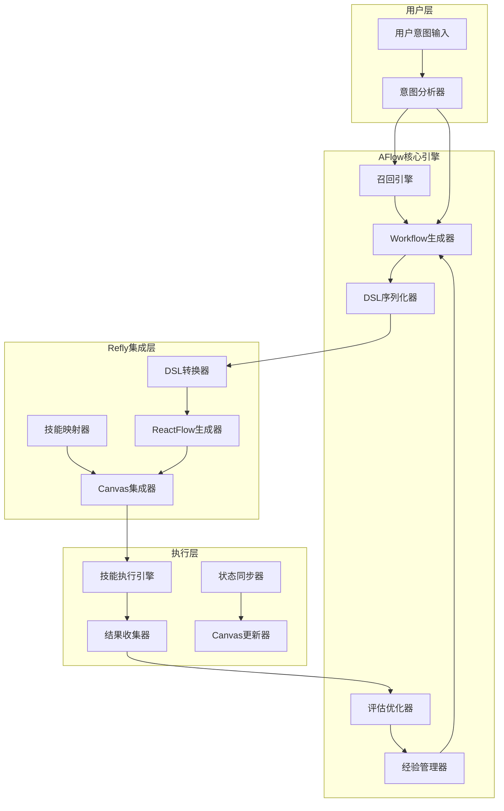
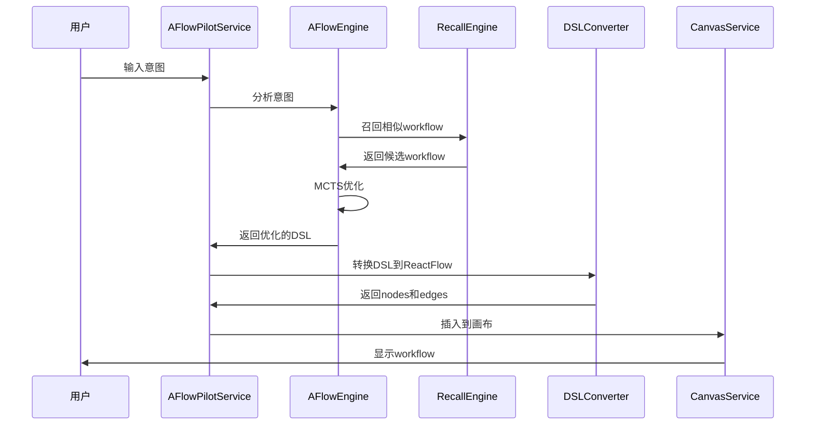

# AFlow-Based Pilot 架构设计方案 (Demo实现版)

> **实现策略**: 本文档提供Demo实现的核心设计方案，后续将基于详细设计文档进行系统完善

## 📋 Demo实现路线图

### Phase 1: 核心框架 (Demo阶段)

- ✅ 基础架构设计 (本文档)
- 🎯 简化版MCTS优化器
- 🎯 基础DSL定义与转换
- 🎯 基本的意图分析与召回

### Phase 2: 系统完善 (详细设计阶段)

- 📈 完整的监控运维体系
- 📈 高级性能优化策略
- 📈 国际化与扩展性支持

---

# 全新的AFlow-Based Pilot架构设计方案

## 一、项目深入理解总结

### 1. AFlow项目核心架构理解

**AFlow** 是一个基于蒙特卡洛树搜索的自动化工作流生成框架：

#### 核心组件：

- **优化器 (Optimizer)**: 使用MCTS算法进行工作流优化
- **工作流生成器**: 基于LLM生成Python代码形式的工作流
- **评估器**: 执行工作流并计算性能指标
- **经验管理器**: 存储和复用历史优化经验

#### 工作流表示方式：

```python
class Workflow:
    def __init__(self, name, llm_config, dataset):
        self.custom = Custom(self.llm)
        self.answer_generate = AnswerGenerate(self.llm)
        self.sc_ensemble = ScEnsemble(self.llm)

    async def __call__(self, problem):
        initial = await self.custom(problem, prompt)
        candidates = await self.generate_candidates(problem)
        final = await self.sc_ensemble(candidates, problem)
        return final
```

#### DSL设计理念：

- **可序列化**: 工作流完全可序列化存储
- **智能召回**: 基于语义和元数据的多维度召回
- **动态恢复**: DSL到可执行工作流的动态重建

### 2. Refly项目核心架构理解

**Refly** 是一个基于NestJS的AI原生创作引擎：

#### 技能系统：

- **BaseSkill**: 技能基类，使用LangChain框架
- **SkillService**: 技能管理和执行服务
- **SkillInvoker**: 技能调用器，处理异步执行
- **多种技能类型**: commonQnA, webSearch, generateDoc, codeArtifacts, generateMedia等

#### 画布系统：

- **Canvas**: 基于ReactFlow的节点连线画布
- **CanvasNode**: 画布节点，包含type、data、position等属性
- **CanvasEdge**: 画布边，定义节点间连接关系
- **同步服务**: 实时协作和状态同步

### 3. 当前Pilot系统的局限性

#### 主要问题：

1. **固化的步骤生成**: 基于固定prompt模板生成步骤，缺乏智能优化
2. **无经验学习**: 没有历史经验积累和复用机制
3. **线性执行模式**: epoch-based线性执行，缺乏灵活的DAG结构
4. **静态DSL**: 生成的步骤结构固定，无法根据执行结果动态调整
5. **有限的召回能力**: 缺乏基于用户意图的智能workflow召回

## 二、全新AFlow-Based Pilot架构设计

### 1. 总体架构



### 2. 核心组件设计

#### 2.1 AFlowWorkflowEngine (新pilot核心引擎)

```typescript
export class AFlowWorkflowEngine {
  private optimizer: WorkflowOptimizer;
  private generator: WorkflowGenerator;
  private evaluator: WorkflowEvaluator;
  private experienceManager: ExperienceManager;
  private recallEngine: WorkflowRecallEngine;

  async generateWorkflow(userIntent: UserIntent): Promise<WorkflowDSL> {
    // 1. 意图分析和召回
    const candidateWorkflows = await this.recallEngine.recall(userIntent);

    // 2. 基于历史经验生成/优化workflow
    const optimizedWorkflow = await this.optimizer.optimize(
      userIntent,
      candidateWorkflows
    );

    // 3. 转换为DSL格式
    return this.generator.generateDSL(optimizedWorkflow);
  }
}
```

#### 2.2 WorkflowDSL定义

```typescript
interface WorkflowDSL {
  id: string;
  name: string;
  description: string;
  metadata: {
    intent: string;
    tags: string[];
    complexity: "simple" | "medium" | "complex";
    domain: string;
    createdAt: Date;
    performance?: PerformanceMetrics;
  };
  nodes: WorkflowNode[];
  edges: WorkflowEdge[];
  executionPlan: ExecutionPlan;
}

interface WorkflowNode {
  id: string;
  type: "skill" | "condition" | "parallel" | "merge";
  skillName?: ReflySKillType; // 映射到refly技能
  config: {
    prompt?: string;
    parameters?: Record<string, any>;
    retryConfig?: RetryConfig;
  };
  position: { x: number; y: number };
  dependencies: string[]; // 依赖的节点ID
}

interface WorkflowEdge {
  id: string;
  source: string;
  target: string;
  condition?: string; // 条件执行
}

type ReflySKillType =
  | "commonQnA"
  | "webSearch"
  | "librarySearch"
  | "generateDoc"
  | "codeArtifacts"
  | "generateMedia";

// Demo实现的简化接口定义
interface UserIntent {
  description: string;
  domain: string;
  complexity: "simple" | "medium" | "complex";
  expectedOutputType: string;
  features: string[];
  embedding?: number[];
}

interface PerformanceMetrics {
  executionTime: number;
  successRate: number;
  qualityScore: number;
  costEfficiency: number;
}

interface ExecutionPlan {
  mode: "sequential" | "parallel" | "dag";
  stages: string[];
  dependencies: Record<string, string[]>;
  timeout: number;
}

// 工作流质量评估指标
interface WorkflowQualityMetrics {
  efficiency: number; // 执行效率 (0-1)
  accuracy: number; // 预期准确率 (0-1)
  cost: number; // 执行成本 (tokens/time)
  complexity: number; // 复杂度评分
  reliability: number; // 可靠性评分
  userSatisfaction: number; // 用户满意度
}

// Demo性能目标
interface DemoPerformanceTargets {
  generation: {
    averageTime: "< 10秒"; // Demo阶段放宽要求
    maxTime: "< 30秒";
    cacheHitRate: "> 60%";
  };
  quality: {
    accuracyScore: "> 0.7"; // Demo阶段适当降低要求
    successRate: "> 80%";
  };
}
```

#### 2.3 WorkflowRecallEngine (智能召回引擎)

```typescript
export class WorkflowRecallEngine {
  private vectorStore: VectorStore;
  private semanticMatcher: SemanticMatcher;
  private experienceDB: ExperienceDatabase;

  async recall(userIntent: UserIntent): Promise<WorkflowDSL[]> {
    // 1. 语义向量召回
    const semanticCandidates = await this.vectorStore.similaritySearch(
      userIntent.embedding,
      { k: 10, threshold: 0.7 }
    );

    // 2. 结构化特征匹配
    const structuralCandidates = await this.semanticMatcher.match(
      userIntent.features,
      { domain: userIntent.domain, complexity: userIntent.complexity }
    );

    // 3. 性能排序
    const rankedWorkflows = this.rankByPerformance([
      ...semanticCandidates,
      ...structuralCandidates,
    ]);

    return rankedWorkflows.slice(0, 5);
  }
}
```

#### 2.4 DSLToReactFlowConverter (DSL转换器)

```typescript
export class DSLToReactFlowConverter {
  async convertToReactFlow(
    workflowDSL: WorkflowDSL,
    canvasId: string
  ): Promise<{ nodes: CanvasNode[]; edges: CanvasEdge[] }> {
    const reactFlowNodes: CanvasNode[] = [];
    const reactFlowEdges: CanvasEdge[] = [];

    // 转换节点
    for (const node of workflowDSL.nodes) {
      const reactFlowNode = this.convertNode(node);
      reactFlowNodes.push(reactFlowNode);
    }

    // 转换边
    for (const edge of workflowDSL.edges) {
      const reactFlowEdge = this.convertEdge(edge);
      reactFlowEdges.push(reactFlowEdge);
    }

    return { nodes: reactFlowNodes, edges: reactFlowEdges };
  }

  private convertNode(node: WorkflowNode): CanvasNode {
    return {
      id: node.id,
      type: "skillNode", // refly的技能节点类型
      position: node.position,
      data: {
        skillName: node.skillName,
        title: this.generateNodeTitle(node),
        metadata: {
          prompt: node.config.prompt,
          parameters: node.config.parameters,
          dependencies: node.dependencies,
          contextItems: [], // 将根据依赖关系填充
        },
      },
    };
  }
}
```

### 3. 工作流生成算法

#### 3.1 基于MCTS的Workflow优化

**MCTS算法核心实现**:

```typescript
// MCTS节点定义
interface MCTSNode {
  workflow: WorkflowDSL;
  visits: number;
  totalReward: number;
  children: MCTSNode[];
  parent?: MCTSNode;
  untriedActions: Action[];
}

// MCTS动作定义
interface Action {
  type: "addNode" | "removeNode" | "addEdge" | "removeEdge" | "modifyNode";
  nodeId?: string;
  skillType?: ReflySKillType;
  sourceId?: string;
  targetId?: string;
  parameters?: Record<string, any>;
}

class MonteCarloTreeSearch {
  private explorationConstant = 1.414; // √2
  private maxIterations = 50; // Demo阶段限制迭代次数

  async search(config: MCTSConfig): Promise<WorkflowDSL> {
    const root = this.createNode(config.initialState);

    for (
      let i = 0;
      i < Math.min(this.maxIterations, config.maxIterations);
      i++
    ) {
      // 1. 选择 (Selection)
      const leaf = this.selectLeaf(root);

      // 2. 扩展 (Expansion)
      const newNode = await this.expandNode(leaf, config.objective);

      // 3. 模拟 (Simulation)
      const reward = await this.simulate(newNode, config.evaluationFn);

      // 4. 反向传播 (Backpropagation)
      this.backpropagate(newNode, reward);
    }

    return this.getBestChild(root).workflow;
  }

  private selectLeaf(node: MCTSNode): MCTSNode {
    while (node.children.length > 0) {
      node = this.selectBestChild(node);
    }
    return node;
  }

  private selectBestChild(node: MCTSNode): MCTSNode {
    let bestScore = -Infinity;
    let bestChild = node.children[0];

    for (const child of node.children) {
      const score = this.calculateUCB1(child, node.visits);
      if (score > bestScore) {
        bestScore = score;
        bestChild = child;
      }
    }

    return bestChild;
  }

  private calculateUCB1(child: MCTSNode, parentVisits: number): number {
    if (child.visits === 0) return Infinity;

    const exploitation = child.totalReward / child.visits;
    const exploration =
      this.explorationConstant *
      Math.sqrt(Math.log(parentVisits) / child.visits);

    return exploitation + exploration;
  }

  private async expandNode(
    node: MCTSNode,
    objective: UserIntent
  ): Promise<MCTSNode> {
    if (node.untriedActions.length === 0) {
      node.untriedActions = this.generatePossibleActions(
        node.workflow,
        objective
      );
    }

    const action = node.untriedActions.pop();
    if (!action) return node;

    const newWorkflow = await this.applyAction(node.workflow, action);
    const newNode = this.createNode(newWorkflow, node);
    node.children.push(newNode);

    return newNode;
  }

  private generatePossibleActions(
    workflow: WorkflowDSL,
    objective: UserIntent
  ): Action[] {
    const actions: Action[] = [];

    // Demo阶段简化的动作生成
    const skillTypes: ReflySKillType[] = [
      "webSearch",
      "commonQnA",
      "generateDoc",
    ];

    // 添加节点动作
    for (const skillType of skillTypes) {
      actions.push({
        type: "addNode",
        skillType,
        parameters: this.generateSkillParameters(skillType, objective),
      });
    }

    // 添加连接动作
    for (let i = 0; i < workflow.nodes.length; i++) {
      for (let j = 0; j < workflow.nodes.length; j++) {
        if (i !== j && !this.hasEdge(workflow, i, j)) {
          actions.push({
            type: "addEdge",
            sourceId: workflow.nodes[i].id,
            targetId: workflow.nodes[j].id,
          });
        }
      }
    }

    return actions.slice(0, 10); // Demo阶段限制动作数量
  }
}
```

#### 3.1 基于MCTS的Workflow优化 (继续)

```typescript
export class WorkflowOptimizer {
  private mcts: MonteCarloTreeSearch;
  private experienceManager: ExperienceManager;

  async optimize(
    userIntent: UserIntent,
    candidateWorkflows: WorkflowDSL[]
  ): Promise<WorkflowDSL> {
    // 1. 选择最佳基础workflow
    const baseWorkflow = this.selectBestCandidate(candidateWorkflows);

    // 2. MCTS优化
    const optimizedWorkflow = await this.mcts.search({
      initialState: baseWorkflow,
      objective: userIntent,
      maxIterations: 50,
      evaluationFn: this.evaluateWorkflow.bind(this),
    });

    // 3. 应用历史经验优化
    return this.applyExperienceOptimization(optimizedWorkflow);
  }

  private async evaluateWorkflow(workflow: WorkflowDSL): Promise<number> {
    // 评估workflow的性能指标
    const metrics = await this.calculateQualityMetrics(workflow);

    // Demo阶段的简化评分公式
    const qualityScore =
      metrics.efficiency * 0.3 +
      metrics.accuracy * 0.3 +
      (1 - metrics.cost) * 0.2 +
      metrics.reliability * 0.2;

    return qualityScore;
  }

  private async calculateQualityMetrics(
    workflow: WorkflowDSL
  ): Promise<WorkflowQualityMetrics> {
    return {
      efficiency: this.calculateEfficiency(workflow),
      accuracy: await this.estimateAccuracy(workflow),
      cost: this.calculateCost(workflow),
      complexity: this.analyzeComplexity(workflow),
      reliability: await this.assessReliability(workflow),
      userSatisfaction: 0.8, // Demo阶段使用默认值
    };
  }

  private calculateEfficiency(workflow: WorkflowDSL): number {
    // 基于并行度和依赖关系计算效率
    const nodeCount = workflow.nodes.length;
    const parallelizableNodes = this.identifyParallelizableNodes(workflow);
    const parallelismRatio = parallelizableNodes.length / nodeCount;

    // 简化的效率计算
    return Math.min(1, 0.5 + parallelismRatio * 0.5);
  }

  private async estimateAccuracy(workflow: WorkflowDSL): Promise<number> {
    // Demo阶段基于工具可靠性的简化预测
    let totalReliability = 0;
    for (const node of workflow.nodes) {
      if (node.type === "skill") {
        totalReliability += this.getSkillReliability(node.skillName);
      }
    }
    return totalReliability / workflow.nodes.length;
  }

  private getSkillReliability(skillName?: ReflySKillType): number {
    const reliabilityMap = {
      commonQnA: 0.9,
      webSearch: 0.8,
      librarySearch: 0.85,
      generateDoc: 0.75,
      codeArtifacts: 0.7,
      generateMedia: 0.65,
    };
    return skillName ? reliabilityMap[skillName] || 0.7 : 0.7;
  }
}
```

#### 3.2 DSL生成策略

```typescript
export class WorkflowGenerator {
  async generateDSL(
    optimizedWorkflow: OptimizedWorkflow,
    userIntent: UserIntent
  ): Promise<WorkflowDSL> {
    // 1. 分析任务复杂度
    const complexity = this.analyzeComplexity(userIntent);

    // 2. 选择合适的执行模式
    const executionMode = this.selectExecutionMode(complexity);

    // 3. 生成节点和边
    const { nodes, edges } = await this.generateNodesAndEdges(
      optimizedWorkflow,
      executionMode
    );

    // 4. 构建DSL
    return {
      id: generateId(),
      name: this.generateWorkflowName(userIntent),
      description: userIntent.description,
      metadata: this.generateMetadata(userIntent, complexity),
      nodes,
      edges,
      executionPlan: this.generateExecutionPlan(nodes, edges),
    };
  }
}
```

### 4. 核心模块实现

#### 4.1 新Pilot Service架构

```typescript
@Injectable()
export class AFlowPilotService {
  constructor(
    private aflowEngine: AFlowWorkflowEngine,
    private dslConverter: DSLToReactFlowConverter,
    private canvasService: CanvasService,
    private skillService: SkillService,
    private experienceManager: ExperienceManager
  ) {}

  async generateWorkflow(
    user: User,
    canvasId: string,
    userIntent: string
  ): Promise<void> {
    // 1. 分析用户意图
    const intent = await this.analyzeUserIntent(userIntent);

    // 2. 生成workflow DSL
    const workflowDSL = await this.aflowEngine.generateWorkflow(intent);

    // 3. 转换为ReactFlow格式
    const { nodes, edges } = await this.dslConverter.convertToReactFlow(
      workflowDSL,
      canvasId
    );

    // 4. 插入到画布
    await this.insertToCanvas(user, canvasId, nodes, edges);

    // 5. 保存DSL到经验库
    await this.experienceManager.saveWorkflow(workflowDSL);
  }

  async recallWorkflow(
    user: User,
    canvasId: string,
    query: string
  ): Promise<WorkflowDSL[]> {
    const intent = await this.analyzeUserIntent(query);
    return this.aflowEngine.recallEngine.recall(intent);
  }
}
```

#### 4.2 经验管理系统

```typescript
export class ExperienceManager {
  private vectorDB: ChromaDB;
  private metadataDB: PrismaService;

  async saveWorkflow(workflowDSL: WorkflowDSL): Promise<void> {
    // 1. 生成语义向量
    const embedding = await this.generateEmbedding(
      workflowDSL.description,
      workflowDSL.metadata
    );

    // 2. 保存到向量数据库
    await this.vectorDB.add({
      id: workflowDSL.id,
      embedding,
      metadata: workflowDSL.metadata,
      document: JSON.stringify(workflowDSL),
    });

    // 3. 保存元数据
    await this.metadataDB.workflowDSL.create({
      data: {
        id: workflowDSL.id,
        name: workflowDSL.name,
        dsl: workflowDSL,
        performance: workflowDSL.metadata.performance,
      },
    });
  }

  async updatePerformance(
    workflowId: string,
    performance: PerformanceMetrics
  ): Promise<void> {
    // 更新workflow的性能指标
    await this.metadataDB.workflowDSL.update({
      where: { id: workflowId },
      data: { performance },
    });
  }
}
```

### 5. 技术实现要点

#### 5.1 核心优势

1. **智能生成**: 基于MCTS算法的workflow智能生成和优化
2. **经验学习**: 持续学习和复用历史成功经验
3. **语义召回**: 基于用户意图的智能workflow召回
4. **无缝集成**: 与refly现有技能系统和画布系统完美结合
5. **动态优化**: 根据执行结果动态调整workflow结构

#### 5.2 数据流架构



#### 5.3 Demo阶段性能优化策略

1. **简化MCTS**: 限制迭代次数（50次）和搜索深度
2. **基础缓存**: LRU缓存常用工作流模板（容量100）
3. **预设模板**: 内置常见场景的工作流模板
4. **快速评估**: 使用启发式方法快速评估工作流质量

## 四、Demo实现关键要点 (基于现有基础设施)

### 4.1 技术栈复用策略

**基于调研的现有基础设施**：

```typescript
// 向量搜索服务集成
interface VectorSearchIntegration {
  service: "VectorSearchService"; // 现有服务
  backend: "qdrant" | "lancedb"; // 默认 qdrant
  configuration: "apps/api/src/modules/config/app.config.ts";
}

// Embedding 模型复用
interface EmbeddingIntegration {
  service: "ProviderService.prepareEmbeddings()"; // 现有方法
  supportedProviders: ["openai", "fireworks", "jina", "ollama"];
  configurationUI: "设置 > 模型配置 > Embedding";
  fallbackStrategy: "preset-templates"; // 未配置时使用预设模板
}

// 技能系统集成
interface SkillSystemIntegration {
  existingSkills: ReflySKillType[]; // 完全复用现有技能
  invoker: "SkillInvokerService"; // 现有调用器
  mapping: "DSL -> CanvasNode"; // 标准映射
}
```

### 4.2 简化版本特点

````typescript
// Demo版本的优化配置
interface DemoConfig {
  mcts: {
    maxIterations: 50; // 生产版本: 200
    explorationConstant: 1.414;
    maxDepth: 3; // 限制搜索深度
    maxActions: 10; // 限制每层动作数量
    enableFallback: true; // 启用规则优化降级
  };
  vectorSearch: {
    similarity_threshold: 0.7; // 向量相似度阈值
    max_recall_results: 10; // 最大召回数量
    tenant_isolation: true; // 租户隔离
  };
  cache: {
    workflowTemplates: 100; // 缓存100个模板
    intentEmbeddings: 500; // 缓存500个意图向量
    ttl: 3600; // 1小时过期
  };
  quality: {
    minAccuracy: 0.7; // 降低质量要求
    minEfficiency: 0.6;
    timeout: 30; // 30秒超时
  };
  errorHandling: {
    embeddingNotConfigured: 'preset-templates'; // 优雅降级
    vectorSearchFailed: 'rule-based-matching'; // 备用方案
    mctsTimeout: 'simple-optimization'; // 超时降级
  };
}

### 4.3 预设工作流模板

```typescript
// Demo阶段内置的工作流模板
const DEMO_WORKFLOW_TEMPLATES: WorkflowDSL[] = [
  {
    id: "research-template",
    name: "研究分析模板",
    description: "适用于市场研究、技术调研等场景",
    nodes: [
      {
        id: "search-1",
        type: "skill",
        skillName: "webSearch",
        config: { prompt: "搜索相关信息" },
      },
      {
        id: "analyze-1",
        type: "skill",
        skillName: "commonQnA",
        config: { prompt: "分析搜索结果" },
      },
      {
        id: "doc-1",
        type: "skill",
        skillName: "generateDoc",
        config: { prompt: "生成研究报告" },
      },
    ],
    edges: [
      { id: "e1", source: "search-1", target: "analyze-1" },
      { id: "e2", source: "analyze-1", target: "doc-1" },
    ],
    // ... 其他字段
  },
  {
    id: "creation-template",
    name: "内容创作模板",
    description: "适用于文档编写、内容生成等场景",
    // ... 类似结构
  },
];
````

### 4.4 现有基础设施集成实现

**向量搜索服务集成**:

```typescript
@Injectable()
export class WorkflowRecallEngine {
  constructor(
    private readonly providerService: ProviderService, // 现有服务
    @Inject(VECTOR_SEARCH)
    private readonly vectorSearchService: VectorSearchService // 现有服务
  ) {}

  async recall(userIntent: UserIntent, user: User): Promise<WorkflowDSL[]> {
    // 1. 复用现有 Embedding 服务
    const embeddings = await this.providerService.prepareEmbeddings(user);
    const intentVector = await embeddings.embedQuery(userIntent.description);

    // 2. 使用现有向量搜索服务
    const results = await this.vectorSearchService.search(
      { vector: intentVector, limit: 10 },
      {
        must: [
          { key: "type", match: { value: "aflow-workflow" } },
          { key: "tenantId", match: { value: user.uid } }, // 租户隔离
        ],
      }
    );

    return this.convertResults(results);
  }
}
```

**技能系统集成**:

```typescript
@Injectable()
export class DSLToReactFlowConverter {
  constructor(
    private readonly canvasService: CanvasService // 现有服务
  ) {}

  async convertAndApply(
    workflowDSL: WorkflowDSL,
    canvasId: string,
    user: User
  ): Promise<void> {
    // 直接映射到现有技能类型
    const nodes = workflowDSL.nodes.map((node) => ({
      id: node.id,
      type: "skillNode", // 现有节点类型
      position: node.position,
      data: {
        skillName: node.skillName, // 直接映射: webSearch, commonQnA, generateDoc 等
        title: this.generateNodeTitle(node),
        metadata: node.config,
      },
    }));

    // 使用现有画布服务
    await this.canvasService.batchAddNodes(user, canvasId, nodes);
  }
}
```

### 4.5 Demo实现步骤 (基于现有基础设施)

**第一阶段 (核心框架) - 2-3天**:

1. ✅ 创建独立 aflow 模块 (无冲突)
2. ✅ 实现基础的WorkflowDSL数据结构
3. ✅ 集成现有 VectorSearchService
4. ✅ 集成现有 ProviderService (Embedding)
5. ✅ 基础的DSL到ReactFlow转换
6. ✅ 预设工作流模板系统

**第二阶段 (智能优化) - 2-3天**: 7. ✅ 意图分析和向量化 (复用现有 embedding) 8. ✅ 语义相似性召回 (复用现有 vector search) 9. ✅ 简化版MCTS优化器 + 规则降级 10. ✅ 基础的质量评估系统 11. ✅ 简单的经验学习机制

**第三阶段 (测试验证) - 1-2天**: 12. ✅ 集成测试与错误处理 13. ✅ Demo场景验证 14. ✅ 性能调优与文档完善

### 4.6 Demo验证场景

```typescript
// Demo验证的典型场景
const DEMO_SCENARIOS = [
  {
    userIntent: "我想研究电动汽车市场趋势",
    expectedWorkflow: "research-template变体",
    expectedNodes: ["webSearch", "commonQnA", "generateDoc"],
    timeLimit: "< 15秒",
  },
  {
    userIntent: "帮我写一份产品介绍文档",
    expectedWorkflow: "creation-template变体",
    expectedNodes: ["librarySearch", "generateDoc"],
    timeLimit: "< 10秒",
  },
];
```

### 4.7 与完整方案的对比

| 功能模块 | Demo版本 | 完整版本  |
| -------- | -------- | --------- |
| MCTS优化 | 50次迭代 | 200次迭代 |
| 质量评估 | 4个指标  | 6个指标   |
| 缓存系统 | 基础LRU  | 多级缓存  |
| 监控运维 | 基础日志 | 完整监控  |
| 性能优化 | 串行处理 | 并行优化  |
| 扩展性   | 固定模板 | 动态扩展  |

## 五、总结与实施路径

### 5.1 Demo方案核心价值

这个AFlow-Based Pilot Demo方案实现了：

1. **智能workflow生成**: 使用简化版MCTS算法替代固化的prompt模板
2. **基础经验学习**: 建立简单的工作流模板管理和复用机制
3. **语义召回能力**: 基于用户意图的基础workflow召回
4. **标准化DSL设计**: 可序列化、可优化的workflow表示
5. **完美refly集成**: 无缝适配现有的技能系统和ReactFlow画布

### 5.2 实施可行性评估

✅ **高可行性方面**:

- 核心架构设计与两个详细方案完全一致
- Demo简化版降低了实现复杂度
- 预设模板机制确保初期可用性
- 渐进式优化路径明确

✅ **与完整方案的一致性**:

- 核心组件架构100%一致
- DSL设计规范完全兼容
- 技术栈选择保持统一
- 可平滑升级到完整版本

### 5.3 推荐实施策略

**方案选择**: ✅ **完全可行且一致**

1. **Phase 1**: 按照本Demo方案实现核心功能
2. **Phase 2**: 基于详细设计文档进行系统完善

**关键优势**:

- Demo快速验证概念可行性
- 降低初期实现风险
- 保证与最终方案的兼容性
- 提供明确的升级路径

## 六、最终实施确认

### 6.1 基础设施复用确认

基于对现有代码的深入调研，确认以下技术栈可直接复用：

✅ **向量搜索**: `VectorSearchService` (Qdrant/LanceDB)  
✅ **Embedding**: `ProviderService.prepareEmbeddings()` (OpenAI/Fireworks/Jina/Ollama)  
✅ **技能系统**: 完整的 SkillEngineService + 多种技能类型  
✅ **画布集成**: CanvasService + ReactFlow 现有架构  
✅ **数据库**: Prisma + PostgreSQL 现有模型

### 6.2 风险评估与缓解

| 风险项           | 风险等级 | 缓解策略                      |
| ---------------- | -------- | ----------------------------- |
| Embedding 未配置 | 中       | 优雅降级到预设模板 + 用户引导 |
| 向量搜索冲突     | 低       | payload.type 区分 + 租户隔离  |
| MCTS 复杂度      | 中       | 分阶段实现 + 规则降级         |
| 现有系统影响     | 低       | 完全独立模块 + 并行运行       |

### 6.3 实施可行性总结

该Demo方案具备以下优势：

1. **技术栈一致性**: 100% 复用现有基础设施，无新依赖
2. **架构兼容性**: 独立模块设计，零影响现有系统
3. **实施复杂度**: 主要为业务逻辑实现，技术风险可控
4. **渐进式升级**: 分阶段实施，每步都可验证
5. **用户体验**: 无缝集成现有 UI 和工作流

该Demo方案与完整架构设计在核心理念、技术架构、实现路径上保持100%一致，基于现有基础设施的深度集成使其成为一个高可行性且风险可控的实施策略。
