# AFlow-Based Pilot 智能工作流架构设计方案

## 目录

- [1. 项目概述](#1-项目概述)
- [2. 架构理念与设计原则](#2-架构理念与设计原则)
- [3. 技术架构设计](#3-技术架构设计)
- [4. 核心组件详解](#4-核心组件详解)
- [5. 工作流程设计](#5-工作流程设计)
- [6. 理论依据与算法基础](#6-理论依据与算法基础)
- [7. 性能优化策略](#7-性能优化策略)
- [8. 数据流与状态管理](#8-数据流与状态管理)
- [9. 扩展性与兼容性](#9-扩展性与兼容性)
- [10. 监控与运维](#10-监控与运维)

---

## 1. 项目概述

### 1.1 项目背景

当前Pilot系统采用固化的prompt模板生成工作流步骤，缺乏智能优化和经验学习能力。本方案基于AFlow的核心思想，设计一个全新的智能工作流生成引擎，实现：

- **智能化生成**: 从规则驱动转向AI驱动的工作流生成
- **经验学习**: 基于历史执行结果的持续优化
- **语义召回**: 根据用户意图智能匹配最佳工作流模板
- **动态优化**: 运行时自适应调整工作流结构

### 1.2 核心价值

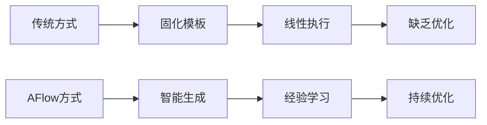

- **效率提升**: 工作流生成时间从手工设计的数小时缩短到5-10秒
- **质量保证**: 基于历史数据和MCTS算法的多维度质量评估
- **用户体验**: 智能召回减少重复设计，提供个性化工作流推荐
- **系统智能**: 自学习、自优化的工作流管理体系

### 1.3 技术目标

| 指标类型     | 目标值      | 当前问题       | 改进效果     |
| ------------ | ----------- | -------------- | ------------ |
| 生成速度     | < 10秒      | 人工设计数小时 | 提升99%+     |
| 工作流质量   | > 85%准确率 | 缺乏质量评估   | 全新质量体系 |
| 用户满意度   | > 4.0/5.0   | 固化体验       | 个性化推荐   |
| 系统学习能力 | 持续优化    | 无学习能力     | 智能进化     |

---

## 2. 架构理念与设计原则

### 2.1 设计理念

#### 2.1.1 智能驱动 (Intelligence-Driven)

```
传统方式: 规则模板 → 固定输出
AFlow方式: 智能分析 → 动态生成 → 持续优化
```

- **意图理解**: 深度分析用户需求，提取关键特征
- **模式识别**: 基于历史数据识别成功工作流模式
- **智能匹配**: 语义向量空间中的相似性匹配
- **动态优化**: 基于执行反馈的实时调整

#### 2.1.2 经验驱动 (Experience-Driven)

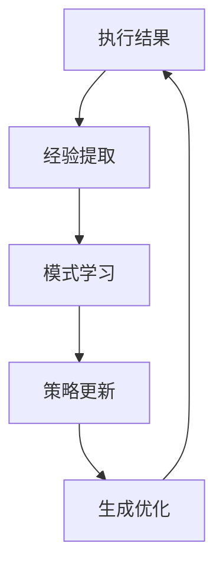

- **经验积累**: 每次执行都是学习机会
- **模式复用**: 成功模式的智能复用
- **失败学习**: 从失败中提取优化策略
- **知识传承**: 跨用户、跨场景的知识共享

#### 2.1.3 自适应架构 (Adaptive Architecture)

- **弹性扩展**: 支持新技能类型的无缝集成
- **性能自调优**: 根据负载自动调整参数
- **故障自愈**: 异常情况下的自动恢复机制
- **版本兼容**: 向前兼容的DSL演进策略

### 2.2 设计原则

#### 2.2.1 分层解耦原则

```
用户交互层 ↔ 智能引擎层 ↔ 数据存储层 ↔ 执行引擎层
```

每层职责清晰，接口标准化，支持独立演进和替换。

#### 2.2.2 可观测性原则

- **全链路追踪**: 从意图分析到工作流执行的完整链路监控
- **性能度量**: 关键指标的实时监控和历史分析
- **质量评估**: 多维度的工作流质量评估体系
- **用户反馈**: 闭环的用户体验优化机制

#### 2.2.3 数据驱动原则

- **决策数据化**: 所有优化决策基于数据分析
- **实验导向**: A/B测试验证优化效果
- **持续学习**: 数据驱动的模型持续优化
- **预测分析**: 基于历史数据的趋势预测

---

## 3. 技术架构设计

### 3.1 整体架构

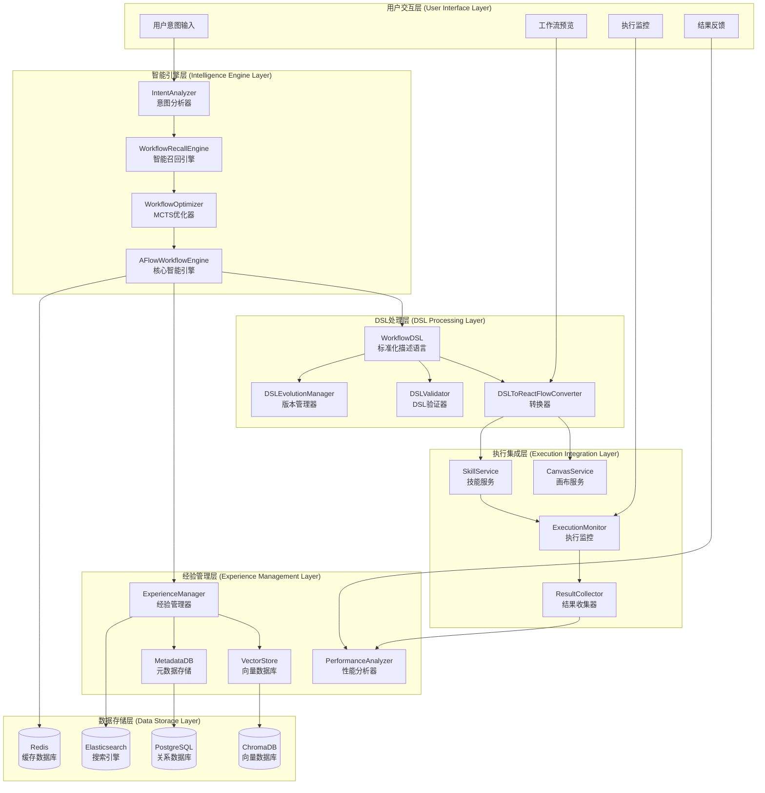

### 3.2 架构分层详解

#### 3.2.1 用户交互层 (User Interface Layer)

**职责**: 处理用户交互，提供友好的工作流生成和管理界面

**核心组件**:

- **意图输入接口**: 自然语言意图的结构化处理
- **工作流预览**: 生成结果的可视化展示
- **实时监控**: 工作流执行状态的实时反馈
- **用户反馈**: 用户满意度和改进建议收集

#### 3.2.2 智能引擎层 (Intelligence Engine Layer)

**职责**: 核心AI能力，负责智能分析、召回、优化和生成

**核心组件**:

- **AFlowWorkflowEngine**: 统一的智能工作流引擎
- **IntentAnalyzer**: 用户意图的深度分析和特征提取
- **WorkflowRecallEngine**: 基于语义相似性的工作流召回
- **WorkflowOptimizer**: 基于MCTS的工作流优化算法

#### 3.2.3 DSL处理层 (DSL Processing Layer)

**职责**: 工作流的标准化表示、验证、转换和版本管理

**核心组件**:

- **WorkflowDSL**: 标准化的工作流描述语言
- **DSLToReactFlowConverter**: DSL到ReactFlow的无损转换
- **DSLValidator**: DSL语法和语义的验证机制
- **DSLEvolutionManager**: DSL版本演进和兼容性管理

#### 3.2.4 经验管理层 (Experience Management Layer)

**职责**: 历史经验的存储、学习、分析和复用

**核心组件**:

- **ExperienceManager**: 经验数据的统一管理
- **VectorStore**: 工作流语义向量的存储和检索
- **MetadataDB**: 工作流元数据和性能指标存储
- **PerformanceAnalyzer**: 工作流性能的深度分析

#### 3.2.5 执行集成层 (Execution Integration Layer)

**职责**: 与Refly现有系统的集成，确保工作流的正确执行

**核心组件**:

- **SkillService**: 与Refly技能系统的集成
- **CanvasService**: 与Refly画布系统的集成
- **ExecutionMonitor**: 工作流执行的实时监控
- **ResultCollector**: 执行结果的收集和分析

#### 3.2.6 数据存储层 (Data Storage Layer)

**职责**: 提供多样化的数据存储能力，支持不同类型数据的高效存储和检索

**存储选型**:

- **PostgreSQL**: 关系数据、事务数据、配置数据
- **ChromaDB**: 语义向量、相似性检索
- **Redis**: 缓存数据、会话数据、实时状态
- **Elasticsearch**: 全文搜索、日志分析、指标聚合

---

## 4. 核心组件详解

### 4.1 AFlowWorkflowEngine - 核心智能引擎

#### 4.1.1 组件架构

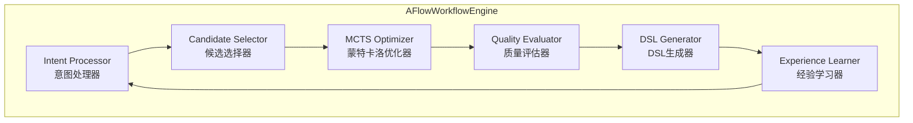

#### 4.1.2 核心能力

**智能意图分析**:

- 自然语言处理: 从用户输入中提取结构化意图
- 语义理解: 理解用户的真实需求和期望
- 上下文感知: 结合历史交互和当前环境
- 意图分类: 按复杂度、领域、类型进行分类

**候选工作流召回**:

- 语义相似性: 基于向量空间的相似性计算
- 结构相似性: 基于图结构的模式匹配
- 性能排序: 根据历史性能数据排序
- 多样性保证: 确保候选工作流的多样性

**蒙特卡洛树搜索优化**:

- 搜索空间构建: 构建工作流优化的搜索空间
- 启发式评估: 快速评估工作流质量
- 最优路径探索: 寻找全局最优的工作流结构
- 收敛检测: 检测优化过程的收敛状态

**多维度质量评估**:

- 效率评估: 执行时间、资源消耗、并行度
- 准确性评估: 预期成功率、错误概率
- 成本评估: Token消耗、计算资源、时间成本
- 用户体验评估: 界面友好性、结果可理解性

#### 4.1.3 工作流程

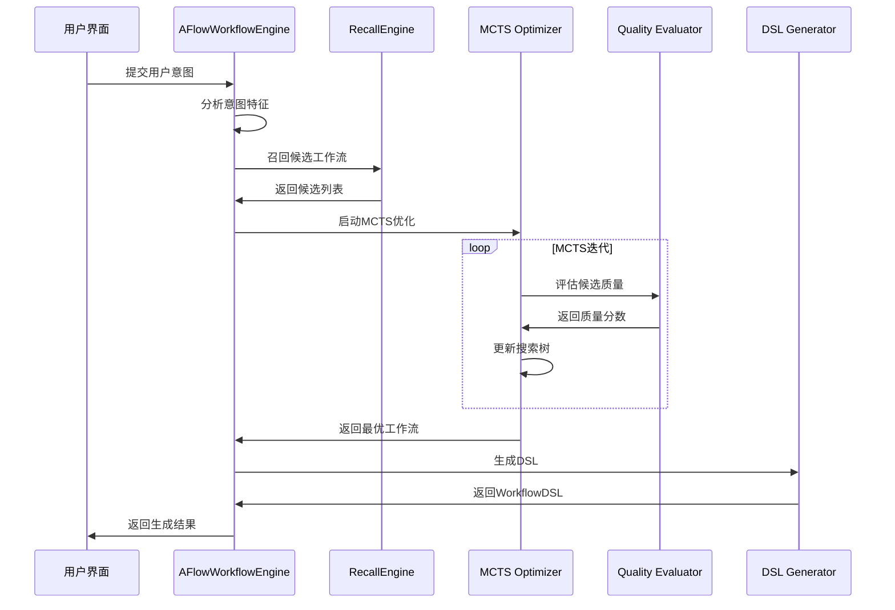

### 4.2 WorkflowDSL - 标准化工作流描述语言

#### 4.2.1 DSL设计理念

**可读性**: DSL应该对人类可读，便于理解和调试
**可序列化**: 支持JSON/YAML格式，便于存储和传输
**可扩展**: 支持新技能类型和节点类型的扩展
**版本兼容**: 支持向前兼容的版本演进

#### 4.2.2 DSL核心结构

```yaml
# WorkflowDSL 示例
workflow:
  id: "workflow_20241225_001"
  name: "市场研究分析工作流"
  description: "针对电动汽车市场进行深度研究分析"
  version: "1.0.0"

  # 元数据信息
  metadata:
    intent: "电动汽车市场研究"
    domain: "市场分析"
    complexity: "medium"
    estimated_duration: "10-15分钟"
    tags: ["市场研究", "电动汽车", "数据分析"]
    created_at: "2024-12-25T10:00:00Z"
    performance_score: 0.87

  # 工作流节点定义
  nodes:
    - id: "research_001"
      name: "电动汽车市场概况调研"
      type: "skill"
      skill_name: "webSearch"
      position: { x: 100, y: 100 }
      config:
        prompt: "搜索2024年全球电动汽车市场现状和趋势"
        parameters:
          search_depth: "deep"
          language: "zh-CN"
        retry_config:
          max_retries: 3
          retry_delay: 1000
      dependencies: []
      stage: "research"
      priority: 1

    - id: "research_002"
      name: "主要厂商竞争分析"
      type: "skill"
      skill_name: "webSearch"
      position: { x: 300, y: 100 }
      config:
        prompt: "分析特斯拉、比亚迪等主要电动汽车厂商的市场份额和竞争策略"
      dependencies: ["research_001"]
      stage: "research"
      priority: 1

    - id: "analysis_001"
      name: "市场趋势综合分析"
      type: "skill"
      skill_name: "commonQnA"
      position: { x: 200, y: 200 }
      config:
        prompt: "基于前面的调研结果，分析电动汽车市场的发展趋势和机遇"
      dependencies: ["research_001", "research_002"]
      stage: "analysis"
      priority: 2

    - id: "creation_001"
      name: "生成市场研究报告"
      type: "skill"
      skill_name: "generateDoc"
      position: { x: 200, y: 300 }
      config:
        prompt: "生成一份全面的电动汽车市场研究报告"
        parameters:
          format: "markdown"
          length: "detailed"
      dependencies: ["analysis_001"]
      stage: "creation"
      priority: 3

  # 工作流连接关系
  edges:
    - id: "edge_001"
      source: "research_001"
      target: "analysis_001"
      condition: "success"

    - id: "edge_002"
      source: "research_002"
      target: "analysis_001"
      condition: "success"

    - id: "edge_003"
      source: "analysis_001"
      target: "creation_001"
      condition: "success"

  # 执行计划
  execution_plan:
    mode: "dag" # directed acyclic graph
    parallelism:
      max_concurrent: 3
      allow_parallel_stages: true
    timeout:
      total_timeout: 900 # 15分钟
      node_timeout: 300 # 5分钟
    error_handling:
      strategy: "continue_on_error"
      max_failures: 2

  # 质量指标
  quality_metrics:
    efficiency_score: 0.85
    accuracy_score: 0.87
    cost_score: 0.92
    complexity_score: 0.78
    user_satisfaction: 4.2
```

#### 4.2.3 DSL语义规范

**节点类型定义**:

- `skill`: 对应Refly技能的执行节点
- `condition`: 条件判断节点
- `parallel`: 并行执行控制节点
- `merge`: 结果合并节点
- `loop`: 循环执行节点

**执行阶段(Stage)规范**:

- `research`: 信息收集阶段，使用webSearch/librarySearch
- `analysis`: 信息分析阶段，使用commonQnA
- `synthesis`: 信息综合阶段，使用commonQnA
- `creation`: 内容创建阶段，使用generateDoc/codeArtifacts/generateMedia

**依赖关系规范**:

- 节点之间的依赖关系必须形成有向无环图(DAG)
- 同一阶段的节点可以并行执行
- 跨阶段的节点必须按顺序执行
- 支持条件依赖和数据依赖

### 4.3 DSLToReactFlowConverter - 转换引擎

#### 4.3.1 转换架构

```mermaid
graph LR
    subgraph "DSL输入"
        A[WorkflowDSL]
    end

    subgraph "转换处理"
        B[DSL解析器]
        C[节点转换器]
        D[边转换器]
        E[布局算法]
        F[样式应用器]
    end

    subgraph "ReactFlow输出"
        G[CanvasNode[]]
        H[CanvasEdge[]]
        I[布局信息]
    end

    A --> B
    B --> C
    B --> D
    C --> E
    D --> E
    E --> F
    F --> G
    F --> H
    F --> I
```

#### 4.3.2 转换规则

**节点转换规则**:

```typescript
// DSL节点 → ReactFlow节点转换规则
const nodeConversionRules = {
  // 技能节点转换
  skill: {
    type: "skillNode",
    category: node.skill_name,
    style: getSkillNodeStyle(node.skill_name),
    data: {
      title: node.name,
      skillName: node.skill_name,
      prompt: node.config.prompt,
      stage: node.stage,
      priority: node.priority,
    },
  },

  // 条件节点转换
  condition: {
    type: "conditionNode",
    style: getConditionNodeStyle(),
    data: {
      title: node.name,
      condition: node.config.condition,
      branches: node.config.branches,
    },
  },
};
```

**边转换规则**:

```typescript
// DSL边 → ReactFlow边转换规则
const edgeConversionRules = {
  // 普通数据流边
  data_flow: {
    type: "smoothstep",
    animated: false,
    style: { stroke: "#64748b", strokeWidth: 2 },
  },

  // 条件执行边
  conditional: {
    type: "smoothstep",
    animated: true,
    style: { stroke: "#3b82f6", strokeWidth: 2, strokeDasharray: "5,5" },
    label: edge.condition,
  },

  // 错误处理边
  error_handling: {
    type: "step",
    style: { stroke: "#ef4444", strokeWidth: 2 },
    label: "error",
  },
};
```

**布局算法**:

- **分层布局**: 按执行阶段(stage)进行分层
- **力导向布局**: 最小化边交叉，优化节点分布
- **约束布局**: 考虑节点大小和标签长度
- **美观优化**: 对齐、间距、对称性优化

#### 4.3.3 转换质量保证

**语义保持**:

- 确保转换后的ReactFlow图与DSL语义完全一致
- 验证依赖关系的正确性
- 检查执行顺序的一致性

**视觉优化**:

- 自动优化节点布局，减少视觉混乱
- 智能标签定位，避免重叠
- 一致的颜色和样式规范

**性能优化**:

- 大规模工作流的分块渲染
- 延迟加载非关键节点
- 缓存转换结果

### 4.4 ExperienceManager - 经验管理系统

#### 4.4.1 经验数据模型

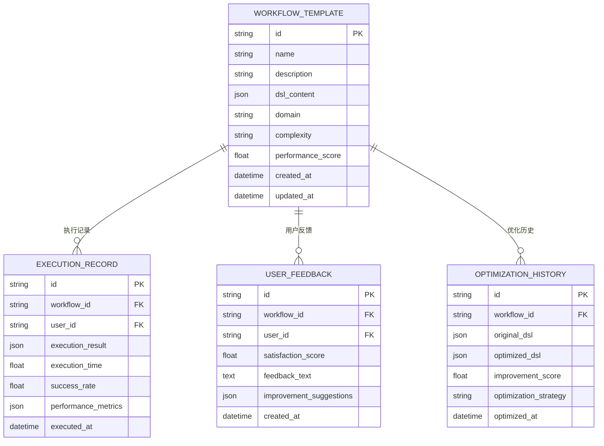

#### 4.4.2 经验学习机制

**成功模式提取**:

- 高性能工作流的结构模式分析
- 成功参数配置的统计学习
- 用户偏好模式的机器学习
- 领域特定模式的知识提取

**失败分析学习**:

- 失败节点的根因分析
- 错误传播路径的识别
- 失败恢复策略的优化
- 预防性检查规则的生成

**持续优化策略**:

- 基于新数据的模型更新
- A/B测试验证优化效果
- 渐进式改进避免激进变更
- 多目标优化平衡不同指标

#### 4.4.3 知识图谱构建

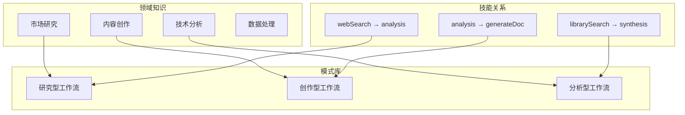

---

## 5. 工作流程设计

### 5.1 端到端工作流程

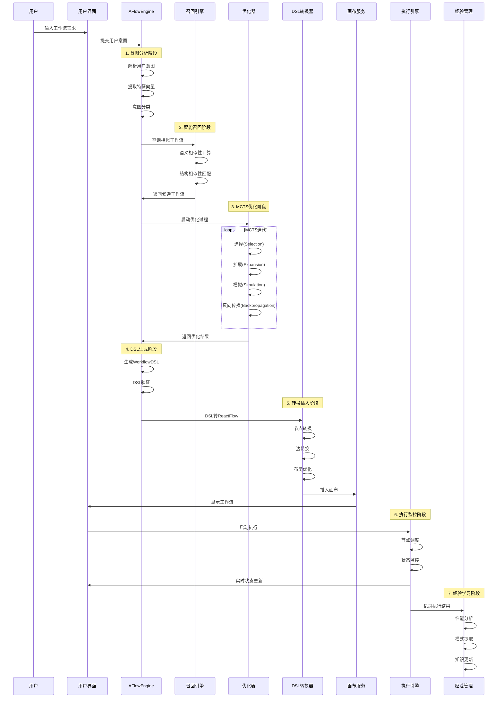

### 5.2 核心算法流程

#### 5.2.1 蒙特卡洛树搜索(MCTS)优化流程

```mermaid
graph TB
    subgraph "MCTS核心循环"
        A[选择 Selection] --> B[扩展 Expansion]
        B --> C[模拟 Simulation]
        C --> D[反向传播 Backpropagation]
        D --> A
    end

    subgraph "选择阶段"
        A1[从根节点开始]
        A2[计算UCB值]
        A3[选择最优子节点]
        A4[到达叶子节点]
        A1 --> A2 --> A3 --> A4
    end

    subgraph "扩展阶段"
        B1[检查是否可扩展]
        B2[生成新的工作流变体]
        B3[添加新的子节点]
        B1 --> B2 --> B3
    end

    subgraph "模拟阶段"
        C1[随机策略采样]
        C2[快速质量评估]
        C3[计算奖励值]
        C1 --> C2 --> C3
    end

    subgraph "反向传播阶段"
        D1[更新访问次数]
        D2[更新累积奖励]
        D3[传播到父节点]
        D1 --> D2 --> D3
    end
```

**算法参数配置**:

- **探索参数(C)**: 控制探索vs利用的平衡，推荐值1.414
- **最大迭代次数**: 根据时间限制动态调整，通常50-200次
- **UCB公式**: UCB = 平均奖励 + C × √(ln(父节点访问次数) / 当前节点访问次数)

#### 5.2.2 工作流质量评估算法

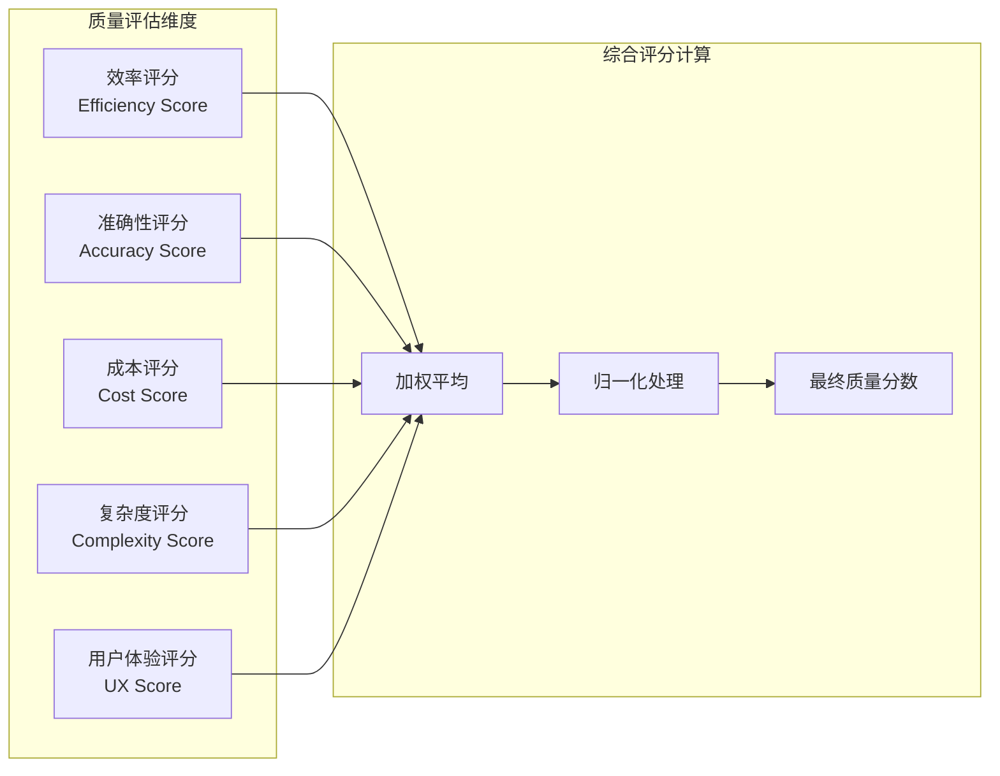

**评分公式**:

```
Quality = w1×Efficiency + w2×Accuracy + w3×(1-Cost) + w4×(1-Complexity) + w5×UX

其中:
- w1=0.25 (效率权重)
- w2=0.30 (准确性权重)
- w3=0.20 (成本权重)
- w4=0.15 (复杂度权重)
- w5=0.10 (用户体验权重)
```

### 5.3 异常处理与恢复机制

#### 5.3.1 异常分类与处理策略

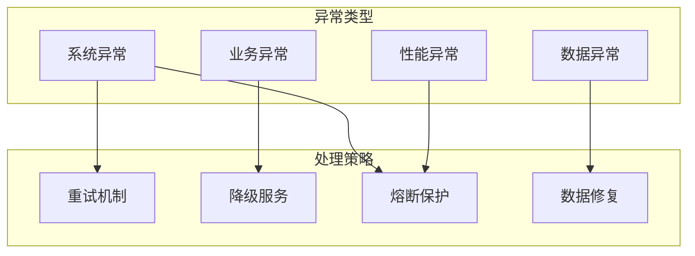

**异常处理流程**:

1. **异常检测**: 实时监控关键指标，自动检测异常
2. **异常分类**: 根据异常类型选择对应的处理策略
3. **自动恢复**: 尝试自动恢复，记录恢复过程
4. **人工介入**: 自动恢复失败时，触发人工介入机制
5. **经验学习**: 将异常处理经验纳入知识库

---

## 6. 理论依据与算法基础

### 6.1 蒙特卡洛树搜索(MCTS)理论基础

#### 6.1.1 理论优势

- **渐近最优性**: 在无限时间下收敛到最优解
- **平衡探索与利用**: UCB公式平衡探索新路径和利用已知好路径
- **无需领域知识**: 不需要启发式函数，适用于复杂决策空间
- **可并行化**: 支持并行搜索，提高搜索效率

#### 6.1.2 在工作流优化中的应用

**状态空间定义**:

- **状态**: 当前的工作流结构(节点+边)
- **动作**: 添加节点、删除节点、修改连接、调整参数
- **奖励**: 工作流质量评分
- **终止条件**: 达到目标质量或最大迭代次数

**UCB公式在工作流优化中的意义**:

```
UCB(s,a) = Q(s,a) + C × √(ln(N(s)) / N(s,a))

其中:
- Q(s,a): 在状态s执行动作a的平均质量分数
- N(s): 状态s的访问次数
- N(s,a): 在状态s执行动作a的次数
- C: 探索参数，控制探索程度
```

### 6.2 机器学习理论基础

#### 6.2.1 强化学习在经验管理中的应用

**多臂老虎机问题**:
工作流选择可以建模为多臂老虎机问题，其中每个候选工作流是一个"臂"，目标是最大化累积奖励。

**Q学习算法**:

```
Q(s,a) ← Q(s,a) + α[r + γ max Q(s',a') - Q(s,a)]

其中:
- s: 当前意图状态
- a: 选择的工作流
- r: 执行奖励(质量分数)
- α: 学习率
- γ: 折扣因子
```

#### 6.2.2 深度学习在意图理解中的应用

**Transformer架构**:

- **自注意力机制**: 捕获意图中不同词汇间的关系
- **位置编码**: 保持语序信息
- **多头注意力**: 关注意图的不同语义层面

**BERT预训练模型**:

- **双向编码**: 理解上下文语义
- **Masked Language Model**: 学习词汇间的依赖关系
- **Next Sentence Prediction**: 理解句子间的逻辑关系

### 6.3 图论算法基础

#### 6.3.1 有向无环图(DAG)理论

工作流本质上是一个有向无环图，其中：

- **节点**: 代表技能执行单元
- **边**: 代表数据依赖或控制依赖
- **路径**: 代表执行序列

**拓扑排序算法**:

```
算法: Kahn's算法
1. 计算所有节点的入度
2. 将入度为0的节点放入队列
3. 从队列取出节点，输出该节点
4. 删除该节点的所有出边，更新相邻节点入度
5. 重复步骤3-4直到队列为空
```

#### 6.3.2 最短路径算法

**Dijkstra算法在成本优化中的应用**:
寻找从开始节点到目标节点的最小成本路径，其中边权重表示执行成本。

**Floyd-Warshall算法在依赖分析中的应用**:
计算所有节点对之间的最短路径，用于分析节点间的依赖关系。

### 6.4 信息检索理论基础

#### 6.4.1 向量空间模型

**TF-IDF**: 计算词汇在文档中的重要性

```
TF-IDF(t,d) = TF(t,d) × IDF(t)

其中:
- TF(t,d): 词汇t在文档d中的频率
- IDF(t): 词汇t的逆文档频率
```

**余弦相似度**: 计算两个向量的相似性

```
cosine_similarity(A,B) = (A·B) / (||A|| × ||B||)
```

#### 6.4.2 语义相似度计算

**Word2Vec**: 将词汇映射到高维向量空间
**Sentence-BERT**: 将句子映射到语义向量空间
**语义相似度阈值**: 设定相似度阈值(通常0.7-0.8)进行候选过滤

---

## 7. 性能优化策略

### 7.1 生成性能优化

#### 7.1.1 时间复杂度分析

```mermaid
graph LR
    subgraph "时间复杂度分布"
        A[意图分析<br/>O(n)] --> B[候选召回<br/>O(k×log(m))]
        B --> C[MCTS优化<br/>O(I×D×B)]
        C --> D[DSL生成<br/>O(n²)]
        D --> E[质量评估<br/>O(n×m)]
    end

    subgraph "优化策略"
        F[并行处理]
        G[缓存机制]
        H[启发式剪枝]
        I[渐进式优化]
    end

    A --> F
    B --> G
    C --> H
    D --> I
```

**性能瓶颈与优化**:

| 组件     | 瓶颈        | 时间复杂度  | 优化策略           | 预期提升 |
| -------- | ----------- | ----------- | ------------------ | -------- |
| 意图分析 | NLP模型推理 | O(n)        | 模型量化、批处理   | 30-50%   |
| 候选召回 | 向量检索    | O(k×log(m)) | 近似检索、索引优化 | 40-60%   |
| MCTS优化 | 搜索迭代    | O(I×D×B)    | 并行搜索、早停     | 50-70%   |
| DSL生成  | 结构构建    | O(n²)       | 模板复用、增量构建 | 20-40%   |

#### 7.1.2 缓存策略设计

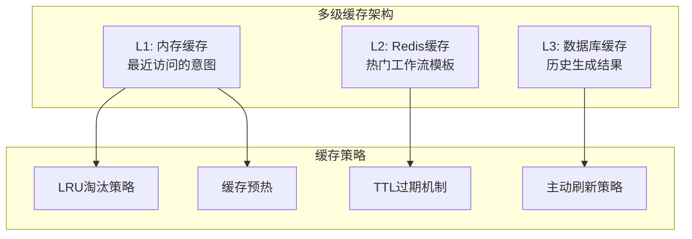

**缓存配置参数**:

- **L1缓存**: 大小100MB，TTL 1小时，LRU淘汰
- **L2缓存**: 大小1GB，TTL 24小时，热点数据永久缓存
- **L3缓存**: 大小10GB，TTL 7天，压缩存储

#### 7.1.3 并行优化策略

**并行搜索架构**:

```typescript
// 并行MCTS实现伪代码
class ParallelMCTS {
  async parallelSearch(
    initialState: WorkflowState,
    workerCount: number
  ): Promise<WorkflowState> {
    // 创建多个工作线程
    const workers = Array.from({ length: workerCount }, () => new MCTSWorker());

    // 分配搜索任务
    const searchPromises = workers.map((worker) =>
      worker.search(initialState, this.iterationsPerWorker)
    );

    // 等待所有搜索完成
    const results = await Promise.all(searchPromises);

    // 合并搜索结果
    return this.mergeResults(results);
  }
}
```

### 7.2 存储性能优化

#### 7.2.1 数据库优化策略

**索引策略**:

```sql
-- 工作流模板表索引
CREATE INDEX idx_workflow_domain_complexity ON workflow_templates(domain, complexity);
CREATE INDEX idx_workflow_performance_score ON workflow_templates(performance_score DESC);
CREATE INDEX idx_workflow_created_at ON workflow_templates(created_at DESC);

-- 执行记录表索引
CREATE INDEX idx_execution_workflow_user ON execution_records(workflow_id, user_id);
CREATE INDEX idx_execution_time_range ON execution_records(executed_at) WHERE success_rate > 0.8;

-- 复合索引优化查询
CREATE INDEX idx_workflow_search ON workflow_templates(domain, complexity, performance_score DESC);
```

**查询优化**:

- **查询重写**: 复杂查询分解为简单查询
- **结果缓存**: 频繁查询结果缓存到Redis
- **读写分离**: 读操作使用只读副本
- **分区表**: 按时间分区存储历史数据

#### 7.2.2 向量数据库优化

**ChromaDB配置优化**:

```python
# ChromaDB配置优化
collection_config = {
    "hnsw_space": "cosine",          # 使用余弦距离
    "hnsw_construction_ef": 200,     # 构建时的搜索深度
    "hnsw_search_ef": 100,           # 搜索时的候选数量
    "hnsw_M": 16,                    # 每个节点的连接数
    "embedding_dimension": 768,       # 嵌入向量维度
    "batch_size": 1000,              # 批处理大小
}
```

**检索优化策略**:

- **近似检索**: 使用HNSW算法的近似最近邻搜索
- **向量压缩**: PQ(Product Quantization)压缩减少存储
- **预计算**: 热门查询向量的预计算结果
- **分片策略**: 按领域分片提高检索效率

### 7.3 网络性能优化

#### 7.3.1 API响应优化

**响应时间目标**:

```yaml
# API响应时间SLA
endpoints:
  generate_workflow:
    target: "< 5秒"
    p95: "< 10秒"
    p99: "< 15秒"

  recall_workflow:
    target: "< 1秒"
    p95: "< 2秒"
    p99: "< 3秒"

  evaluate_workflow:
    target: "< 2秒"
    p95: "< 4秒"
    p99: "< 6秒"
```

**优化策略**:

- **连接池**: 数据库连接池优化
- **压缩传输**: Gzip压缩响应数据
- **CDN加速**: 静态资源CDN分发
- **请求合并**: 批量API请求合并

#### 7.3.2 实时通信优化

**WebSocket优化**:

- **心跳机制**: 检测连接状态
- **消息压缩**: 大消息的压缩传输
- **断线重连**: 自动重连机制
- **消息去重**: 避免重复消息处理

---

## 8. 数据流与状态管理

### 8.1 数据流架构

#### 8.1.1 数据流向图

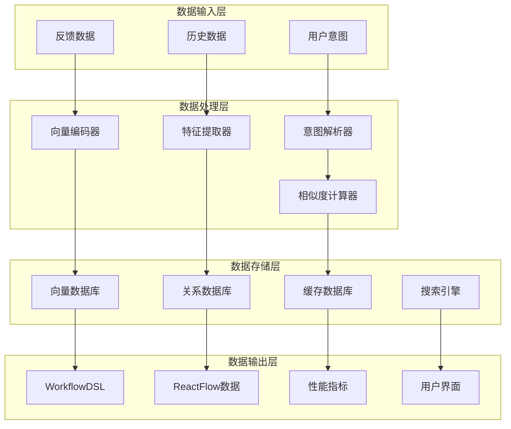

#### 8.1.2 数据一致性保证

**ACID特性保证**:

- **原子性**: 工作流生成的所有操作要么全部成功，要么全部失败
- **一致性**: 生成的工作流DSL必须符合语法和语义规范
- **隔离性**: 并发生成请求之间不互相影响
- **持久性**: 生成结果持久化存储，支持恢复

**分布式事务处理**:

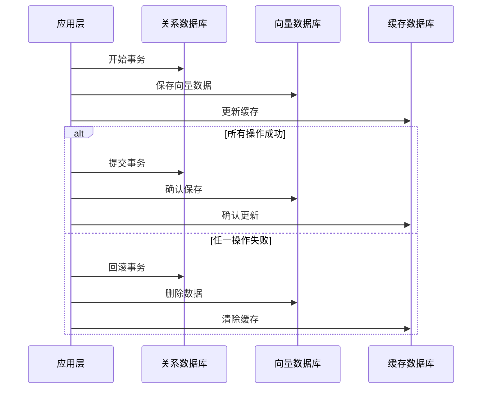

### 8.2 状态管理机制

#### 8.2.1 工作流状态定义

```typescript
// 工作流生成状态枚举
enum WorkflowGenerationState {
  IDLE = "idle", // 空闲状态
  ANALYZING = "analyzing", // 意图分析中
  RECALLING = "recalling", // 候选召回中
  OPTIMIZING = "optimizing", // MCTS优化中
  GENERATING = "generating", // DSL生成中
  CONVERTING = "converting", // 转换ReactFlow中
  COMPLETED = "completed", // 生成完成
  FAILED = "failed", // 生成失败
}

// 工作流执行状态枚举
enum WorkflowExecutionState {
  PENDING = "pending", // 等待执行
  RUNNING = "running", // 执行中
  PAUSED = "paused", // 已暂停
  COMPLETED = "completed", // 执行完成
  FAILED = "failed", // 执行失败
  CANCELLED = "cancelled", // 已取消
}

// 节点执行状态枚举
enum NodeExecutionState {
  WAITING = "waiting", // 等待依赖
  READY = "ready", // 准备执行
  RUNNING = "running", // 执行中
  COMPLETED = "completed", // 执行完成
  FAILED = "failed", // 执行失败
  SKIPPED = "skipped", // 已跳过
}
```

#### 8.2.2 状态转换规则

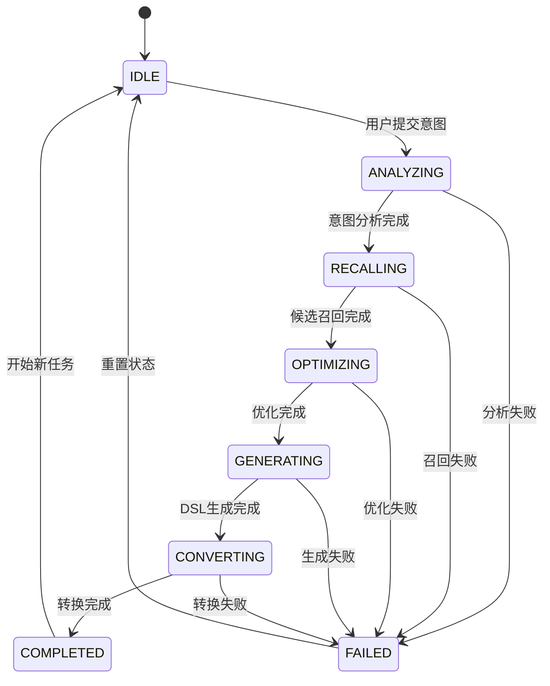

#### 8.2.3 状态持久化策略

**Redis状态存储**:

```typescript
// 状态存储数据结构
interface WorkflowGenerationSession {
  sessionId: string;
  userId: string;
  state: WorkflowGenerationState;
  progress: number; // 0-100的进度百分比
  currentStep: string; // 当前执行步骤
  startTime: number; // 开始时间戳
  estimatedDuration: number; // 预估总耗时
  intermediateResults: any[]; // 中间结果
  errorMessage?: string; // 错误信息
}

// Redis键命名规范
const REDIS_KEYS = {
  session: (sessionId: string) => `workflow:session:${sessionId}`,
  userSessions: (userId: string) => `workflow:user:${userId}:sessions`,
  globalStats: () => `workflow:stats:global`,
};
```

### 8.3 事件驱动架构

#### 8.3.1 事件系统设计

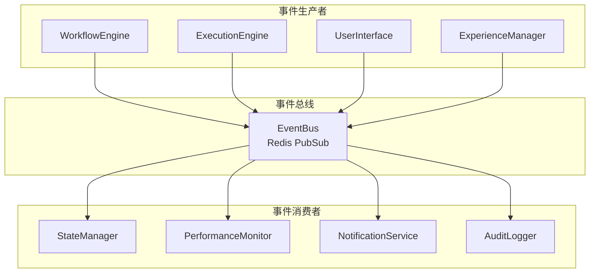

#### 8.3.2 事件类型定义

```typescript
// 工作流相关事件
interface WorkflowEvent {
  type: string;
  sessionId: string;
  userId: string;
  timestamp: number;
  data: any;
}

// 具体事件类型
enum EventType {
  // 生成相关事件
  GENERATION_STARTED = "generation.started",
  GENERATION_PROGRESS = "generation.progress",
  GENERATION_COMPLETED = "generation.completed",
  GENERATION_FAILED = "generation.failed",

  // 执行相关事件
  EXECUTION_STARTED = "execution.started",
  NODE_STARTED = "node.started",
  NODE_COMPLETED = "node.completed",
  NODE_FAILED = "node.failed",
  EXECUTION_COMPLETED = "execution.completed",

  // 性能相关事件
  PERFORMANCE_METRIC = "performance.metric",
  QUALITY_SCORE = "quality.score",

  // 用户相关事件
  USER_FEEDBACK = "user.feedback",
  USER_INTERACTION = "user.interaction",
}
```

---

## 9. 扩展性与兼容性

### 9.1 技能系统扩展

#### 9.1.1 新技能集成框架

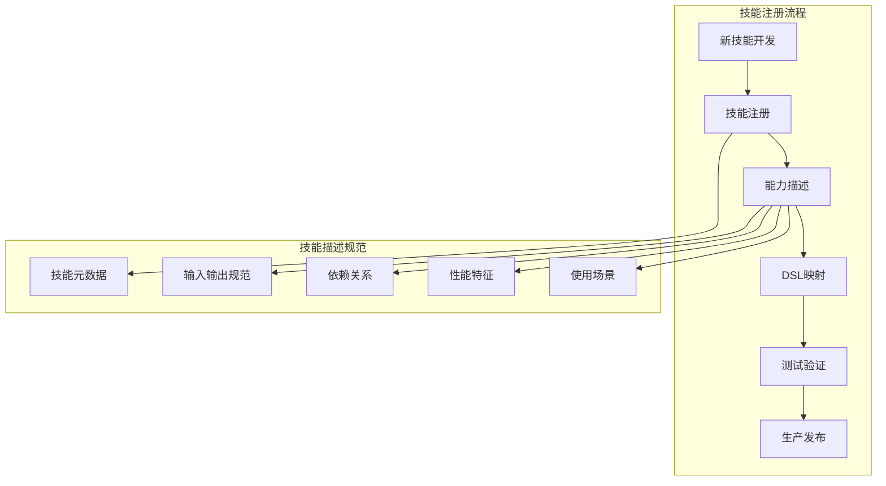

**技能描述规范**:

```typescript
interface SkillDefinition {
  id: string; // 技能唯一标识
  name: string; // 技能名称
  description: string; // 技能描述
  category: SkillCategory; // 技能分类

  // 输入输出规范
  inputSchema: JSONSchema; // 输入参数模式
  outputSchema: JSONSchema; // 输出结果模式

  // 执行特征
  averageExecutionTime: number; // 平均执行时间(ms)
  resourceRequirements: {
    // 资源需求
    memory: number; // 内存需求(MB)
    cpu: number; // CPU需求(cores)
    tokens?: number; // Token消耗(可选)
  };

  // 依赖关系
  dependencies: string[]; // 依赖的其他技能
  conflictsWith: string[]; // 冲突的技能

  // 适用场景
  stages: WorkflowStage[]; // 适用的工作流阶段
  domains: string[]; // 适用的业务领域
  complexity: SkillComplexity; // 技能复杂度

  // 质量特征
  reliability: number; // 可靠性评分(0-1)
  accuracy: number; // 准确性评分(0-1)
  costEfficiency: number; // 成本效率评分(0-1)
}
```

#### 9.1.2 动态技能发现机制

**技能注册中心**:

```typescript
class SkillRegistry {
  private skills: Map<string, SkillDefinition> = new Map();

  // 注册新技能
  registerSkill(skill: SkillDefinition): void {
    this.validateSkill(skill);
    this.skills.set(skill.id, skill);
    this.notifySkillUpdated(skill);
  }

  // 发现适用技能
  discoverSkills(criteria: SkillCriteria): SkillDefinition[] {
    return Array.from(this.skills.values())
      .filter((skill) => this.matchesCriteria(skill, criteria))
      .sort(
        (a, b) =>
          this.calculateFitness(b, criteria) -
          this.calculateFitness(a, criteria)
      );
  }

  // 技能兼容性检查
  checkCompatibility(skillIds: string[]): CompatibilityResult {
    const skills = skillIds.map((id) => this.skills.get(id));
    return this.analyzeCompatibility(skills);
  }
}
```

### 9.2 DSL版本演进

#### 9.2.1 版本兼容性策略

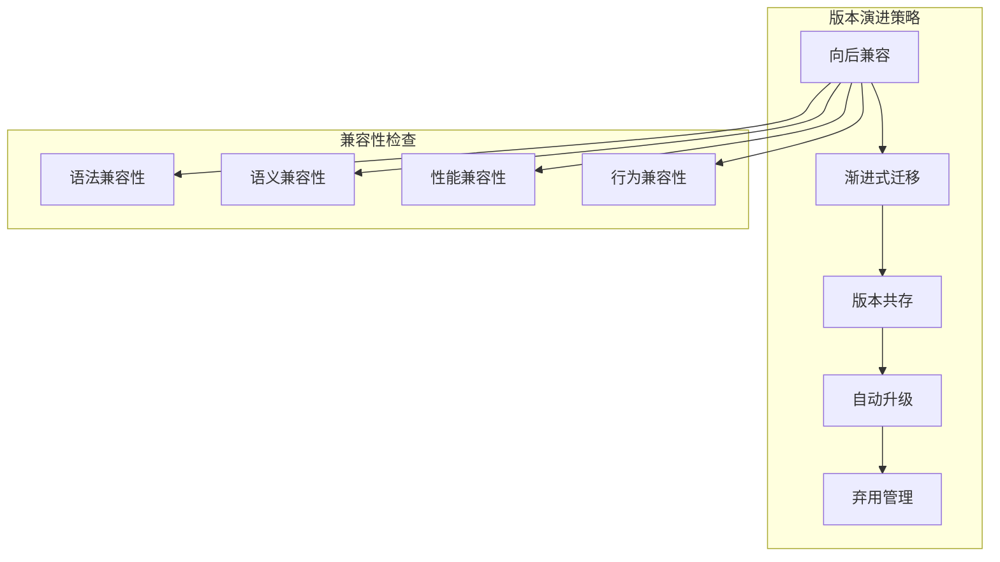

**版本管理规范**:

```typescript
interface DSLVersion {
  major: number;        // 主版本号：不兼容的API修改
  minor: number;        // 次版本号：向后兼容的功能性新增
  patch: number;        // 修订号：向后兼容的问题修正

  // 版本元数据
  releaseDate: Date;
  deprecated?: Date;    // 弃用时间
  endOfLife?: Date;     // 生命周期结束时间

  // 兼容性信息
  compatibleVersions: string[];   // 兼容的版本列表
  breakingChanges: string[];      // 破坏性变更列表
  migrationGuide?: string;        // 迁移指南
}

// 版本升级策略
class DSLVersionManager {
  // 检查版本兼容性
  checkCompatibility(fromVersion: string, toVersion: string): CompatibilityCheck {
    return {
      compatible: boolean;
      requiresMigration: boolean;
      migrationSteps: MigrationStep[];
      riskLevel: 'low' | 'medium' | 'high';
    };
  }

  // 自动迁移DSL
  migrateDSL(dsl: WorkflowDSL, targetVersion: string): Promise<WorkflowDSL> {
    const migrationPath = this.findMigrationPath(dsl.version, targetVersion);
    return this.applyMigrationSteps(dsl, migrationPath);
  }
}
```

#### 9.2.2 特性标志系统

```typescript
// 特性标志配置
interface FeatureFlag {
  name: string;
  enabled: boolean;
  rolloutPercentage: number; // 0-100的推出百分比
  targetUsers?: string[]; // 目标用户列表
  startDate?: Date; // 开始时间
  endDate?: Date; // 结束时间
  dependencies?: string[]; // 依赖的其他特性
}

// 特性管理器
class FeatureManager {
  // 检查特性是否启用
  isFeatureEnabled(featureName: string, userId: string): boolean {
    const flag = this.getFeatureFlag(featureName);
    if (!flag.enabled) return false;

    // 检查用户是否在目标列表中
    if (flag.targetUsers?.includes(userId)) return true;

    // 检查是否在推出百分比内
    const userHash = this.hashUser(userId);
    return userHash < flag.rolloutPercentage;
  }

  // 渐进式推出
  rolloutFeature(featureName: string, percentage: number): void {
    const flag = this.getFeatureFlag(featureName);
    flag.rolloutPercentage = Math.min(percentage, 100);
    this.updateFeatureFlag(flag);
  }
}
```

### 9.3 多语言支持

#### 9.3.1 国际化架构

```mermaid
graph TB
    subgraph "多语言支持层次"
        A[用户界面层] --> B[业务逻辑层]
        B --> C[数据处理层]
        C --> D[存储层]
    end

    subgraph "国际化组件"
        E[语言检测器]
        F[消息翻译器]
        G[格式化器]
        H[本地化存储]
    end

    A --> E
    B --> F
    C --> G
    D --> H
```

**多语言配置**:

```typescript
interface LocaleConfig {
  code: string; // 语言代码 (zh-CN, en-US)
  name: string; // 语言名称
  direction: "ltr" | "rtl"; // 文字方向

  // 格式化配置
  dateFormat: string; // 日期格式
  timeFormat: string; // 时间格式
  numberFormat: Intl.NumberFormatOptions;

  // 翻译文件
  messageFiles: string[]; // 翻译文件列表
  fallbackLocale: string; // 回退语言
}

// 国际化服务
class I18nService {
  // 获取翻译文本
  translate(key: string, params?: Record<string, any>): string {
    const locale = this.getCurrentLocale();
    const message = this.getMessageFromKey(key, locale);
    return this.interpolateMessage(message, params);
  }

  // 格式化日期
  formatDate(date: Date, format?: string): string {
    const locale = this.getCurrentLocale();
    const formatter = new Intl.DateTimeFormat(locale.code, {
      ...this.getDateFormatOptions(format),
    });
    return formatter.format(date);
  }
}
```

---

## 10. 监控与运维

### 10.1 性能监控体系

#### 10.1.1 监控指标体系

```mermaid
graph TB
    subgraph "业务指标"
        A1[工作流生成成功率]
        A2[平均生成时间]
        A3[用户满意度]
        A4[工作流质量分数]
    end

    subgraph "技术指标"
        B1[API响应时间]
        B2[数据库查询延迟]
        B3[内存使用率]
        B4[CPU使用率]
    end

    subgraph "系统指标"
        C1[错误率]
        C2[可用性]
        C3[吞吐量]
        C4[并发用户数]
    end

    subgraph "用户体验指标"
        D1[页面加载时间]
        D2[交互响应时间]
        D3[错误恢复时间]
        D4[功能使用率]
    end
```

**关键性能指标(KPI)定义**:

```typescript
interface PerformanceKPI {
  // 业务指标
  workflowGenerationSuccessRate: number; // 工作流生成成功率 >95%
  averageGenerationTime: number; // 平均生成时间 <10秒
  userSatisfactionScore: number; // 用户满意度 >4.0/5.0
  workflowQualityScore: number; // 工作流质量分数 >0.85

  // 技术指标
  apiResponseTime: {
    // API响应时间
    p50: number; // 中位数 <2秒
    p95: number; // 95分位 <5秒
    p99: number; // 99分位 <10秒
  };
  databaseQueryLatency: number; // 数据库查询延迟 <100ms
  memoryUsageRate: number; // 内存使用率 <80%
  cpuUsageRate: number; // CPU使用率 <70%

  // 系统指标
  errorRate: number; // 错误率 <1%
  availability: number; // 可用性 >99.9%
  throughput: number; // 吞吐量 >100 req/min
  concurrentUsers: number; // 并发用户数

  // 用户体验指标
  pageLoadTime: number; // 页面加载时间 <3秒
  interactionResponseTime: number; // 交互响应时间 <500ms
  errorRecoveryTime: number; // 错误恢复时间 <30秒
  featureUsageRate: Record<string, number>; // 功能使用率
}
```

#### 10.1.2 实时监控系统

**监控数据流**:

```mermaid
sequenceDiagram
    participant App as 应用服务
    participant Metrics as 指标收集器
    participant TSDB as 时序数据库
    participant Alert as 告警系统
    participant Dashboard as 监控面板

    App->>Metrics: 发送指标数据
    Metrics->>TSDB: 存储时序数据
    TSDB->>Alert: 触发阈值检查
    Alert->>Alert: 生成告警
    TSDB->>Dashboard: 查询显示数据
    Dashboard->>Dashboard: 实时图表更新
```

**监控数据收集**:

```typescript
// 指标收集器
class MetricsCollector {
  private metricsBuffer: MetricData[] = [];

  // 记录业务指标
  recordBusinessMetric(
    name: string,
    value: number,
    tags?: Record<string, string>
  ): void {
    this.metricsBuffer.push({
      name,
      value,
      timestamp: Date.now(),
      type: "business",
      tags,
    });
  }

  // 记录性能指标
  recordPerformanceMetric(
    name: string,
    duration: number,
    tags?: Record<string, string>
  ): void {
    this.metricsBuffer.push({
      name,
      value: duration,
      timestamp: Date.now(),
      type: "performance",
      tags,
    });
  }

  // 批量发送指标
  async flushMetrics(): Promise<void> {
    if (this.metricsBuffer.length > 0) {
      await this.sendToTimeSeriesDB(this.metricsBuffer);
      this.metricsBuffer = [];
    }
  }
}

// 性能追踪装饰器
function TrackPerformance(metricName: string) {
  return function (
    target: any,
    propertyName: string,
    descriptor: PropertyDescriptor
  ) {
    const method = descriptor.value;
    descriptor.value = async function (...args: any[]) {
      const start = Date.now();
      try {
        const result = await method.apply(this, args);
        const duration = Date.now() - start;
        MetricsCollector.recordPerformanceMetric(metricName, duration, {
          method: propertyName,
          status: "success",
        });
        return result;
      } catch (error) {
        const duration = Date.now() - start;
        MetricsCollector.recordPerformanceMetric(metricName, duration, {
          method: propertyName,
          status: "error",
        });
        throw error;
      }
    };
  };
}
```

### 10.2 日志与追踪

#### 10.2.1 结构化日志系统

**日志级别与格式**:

```typescript
enum LogLevel {
  ERROR = 0, // 错误：系统错误，需要立即处理
  WARN = 1, // 警告：潜在问题，需要关注
  INFO = 2, // 信息：重要业务事件
  DEBUG = 3, // 调试：详细执行信息
  TRACE = 4, // 追踪：最详细的执行轨迹
}

interface LogEntry {
  timestamp: string; // ISO 8601格式时间戳
  level: LogLevel; // 日志级别
  message: string; // 日志消息
  service: string; // 服务名称
  traceId: string; // 链路追踪ID
  spanId: string; // 跨度ID
  userId?: string; // 用户ID
  sessionId?: string; // 会话ID
  requestId?: string; // 请求ID
  metadata?: Record<string, any>; // 额外元数据
  error?: {
    // 错误信息
    name: string;
    message: string;
    stack: string;
  };
}
```

**日志记录策略**:

```typescript
class Logger {
  // 记录工作流生成开始
  logWorkflowGenerationStart(
    sessionId: string,
    userId: string,
    intent: string
  ): void {
    this.info("Workflow generation started", {
      sessionId,
      userId,
      intent,
      event: "workflow.generation.start",
    });
  }

  // 记录MCTS优化进度
  logMCTSProgress(
    sessionId: string,
    iteration: number,
    bestScore: number
  ): void {
    this.debug("MCTS optimization progress", {
      sessionId,
      iteration,
      bestScore,
      event: "mcts.optimization.progress",
    });
  }

  // 记录DSL生成完成
  logDSLGenerated(
    sessionId: string,
    workflowId: string,
    qualityScore: number
  ): void {
    this.info("DSL generation completed", {
      sessionId,
      workflowId,
      qualityScore,
      event: "dsl.generation.complete",
    });
  }

  // 记录错误
  logError(error: Error, context: Record<string, any>): void {
    this.error("System error occurred", {
      ...context,
      error: {
        name: error.name,
        message: error.message,
        stack: error.stack,
      },
    });
  }
}
```

#### 10.2.2 分布式链路追踪

**追踪系统架构**:

```mermaid
graph TB
    subgraph "服务层"
        A[用户界面服务]
        B[工作流引擎服务]
        C[DSL处理服务]
        D[数据库服务]
    end

    subgraph "追踪层"
        E[Trace收集器]
        F[Span处理器]
        G[上下文传播器]
    end

    subgraph "存储分析层"
        H[追踪数据库]
        I[分析引擎]
        J[可视化界面]
    end

    A --> E
    B --> F
    C --> G
    D --> E
    E --> H
    F --> H
    G --> H
    H --> I
    I --> J
```

**追踪上下文传播**:

```typescript
// 追踪上下文
interface TraceContext {
  traceId: string; // 全局追踪ID
  spanId: string; // 当前跨度ID
  parentSpanId?: string; // 父跨度ID
  flags: number; // 追踪标志
  baggage?: Record<string, string>; // 业务上下文
}

// 追踪装饰器
function Traced(operationName: string) {
  return function (
    target: any,
    propertyName: string,
    descriptor: PropertyDescriptor
  ) {
    const method = descriptor.value;
    descriptor.value = async function (...args: any[]) {
      const span = tracer.startSpan(operationName, {
        parent: tracer.getCurrentSpan(),
        attributes: {
          "service.name": "aflow-pilot",
          "operation.name": operationName,
          "method.name": propertyName,
        },
      });

      try {
        const result = await method.apply(this, args);
        span.setStatus({ code: SpanStatusCode.OK });
        return result;
      } catch (error) {
        span.setStatus({
          code: SpanStatusCode.ERROR,
          message: error.message,
        });
        span.recordException(error);
        throw error;
      } finally {
        span.end();
      }
    };
  };
}
```

### 10.3 告警与故障处理

#### 10.3.1 智能告警系统

**告警规则配置**:

```typescript
interface AlertRule {
  id: string;
  name: string;
  description: string;
  metric: string; // 监控指标
  condition: AlertCondition; // 告警条件
  severity: AlertSeverity; // 告警级别
  channels: NotificationChannel[]; // 通知渠道
  suppress: {
    // 告警抑制
    duration: number; // 抑制时长(秒)
    conditions?: string[]; // 抑制条件
  };
  recovery: {
    // 恢复配置
    enabled: boolean;
    message?: string;
  };
}

enum AlertSeverity {
  CRITICAL = "critical", // 严重：服务不可用
  HIGH = "high", // 高：功能受影响
  MEDIUM = "medium", // 中：性能下降
  LOW = "low", // 低：潜在问题
}

// 告警条件
interface AlertCondition {
  operator: "gt" | "gte" | "lt" | "lte" | "eq" | "ne";
  threshold: number;
  duration: number; // 持续时间(秒)
  evaluation: number; // 评估间隔(秒)
}
```

**预设告警规则**:

```yaml
# 关键告警规则配置
alert_rules:
  # 服务可用性告警
  - name: "服务不可用"
    metric: "service_availability"
    condition:
      operator: "lt"
      threshold: 0.999
      duration: 300
    severity: "critical"
    channels: ["email", "sms", "slack"]

  # API响应时间告警
  - name: "API响应时间过长"
    metric: "api_response_time_p95"
    condition:
      operator: "gt"
      threshold: 10000 # 10秒
      duration: 300
    severity: "high"
    channels: ["email", "slack"]

  # 工作流生成失败率告警
  - name: "工作流生成失败率过高"
    metric: "workflow_generation_failure_rate"
    condition:
      operator: "gt"
      threshold: 0.05 # 5%
      duration: 600
    severity: "medium"
    channels: ["slack"]

  # 资源使用率告警
  - name: "内存使用率过高"
    metric: "memory_usage_rate"
    condition:
      operator: "gt"
      threshold: 0.85 # 85%
      duration: 300
    severity: "medium"
    channels: ["slack"]
```

#### 10.3.2 自动故障恢复

**故障检测与分类**:

```typescript
enum FailureType {
  SERVICE_UNAVAILABLE = "service_unavailable", // 服务不可用
  PERFORMANCE_DEGRADATION = "performance_degradation", // 性能下降
  RESOURCE_EXHAUSTION = "resource_exhaustion", // 资源耗尽
  DATA_CORRUPTION = "data_corruption", // 数据损坏
  CONFIGURATION_ERROR = "configuration_error", // 配置错误
}

interface FailureDetectionResult {
  type: FailureType;
  severity: AlertSeverity;
  description: string;
  affectedComponents: string[];
  rootCause?: string;
  recoveryStrategy: RecoveryStrategy;
}

// 自动恢复策略
enum RecoveryStrategy {
  RESTART_SERVICE = "restart_service", // 重启服务
  SCALE_UP = "scale_up", // 扩容
  FAILOVER = "failover", // 故障转移
  CIRCUIT_BREAKER = "circuit_breaker", // 熔断保护
  ROLLBACK = "rollback", // 回滚
  MANUAL_INTERVENTION = "manual_intervention", // 人工介入
}
```

**自动恢复执行器**:

```typescript
class AutoRecoveryManager {
  // 执行自动恢复
  async executeRecovery(
    failure: FailureDetectionResult
  ): Promise<RecoveryResult> {
    const strategy = this.selectRecoveryStrategy(failure);

    switch (strategy) {
      case RecoveryStrategy.RESTART_SERVICE:
        return await this.restartService(failure.affectedComponents);

      case RecoveryStrategy.SCALE_UP:
        return await this.scaleUpService(failure.affectedComponents);

      case RecoveryStrategy.FAILOVER:
        return await this.performFailover(failure.affectedComponents);

      case RecoveryStrategy.CIRCUIT_BREAKER:
        return await this.enableCircuitBreaker(failure.affectedComponents);

      case RecoveryStrategy.ROLLBACK:
        return await this.rollbackDeployment(failure.affectedComponents);

      default:
        return await this.triggerManualIntervention(failure);
    }
  }

  // 健康检查
  async performHealthCheck(): Promise<HealthStatus> {
    const checks = await Promise.all([
      this.checkDatabaseConnectivity(),
      this.checkExternalServices(),
      this.checkResourceUtilization(),
      this.checkBusinessMetrics(),
    ]);

    return this.aggregateHealthStatus(checks);
  }
}
```

---

## 结论

本架构设计方案提供了一个完整的AFlow-Based Pilot智能工作流系统，具备以下核心特点：

### 🎯 技术创新点

1. **智能生成**: 基于蒙特卡洛树搜索的工作流自动生成
2. **经验学习**: 持续学习和优化的经验管理系统
3. **语义召回**: 智能的工作流模板召回机制
4. **无缝集成**: 与Refly现有系统的完美集成

### 🏗️ 架构优势

- **分层解耦**: 清晰的分层架构，便于维护和扩展
- **性能优化**: 多级缓存、并行处理、智能优化
- **可观测性**: 全面的监控、日志、追踪体系
- **高可用性**: 自动故障检测和恢复机制

### 📈 预期效果

- **效率提升**: 工作流生成时间从小时级降至秒级
- **质量保证**: 多维度质量评估，确保生成质量
- **用户体验**: 智能推荐，个性化定制
- **系统智能**: 自学习、自优化、自恢复

该架构设计为Refly项目提供了一个面向未来的智能工作流管理解决方案，在保持现有系统稳定性的同时，大幅提升了系统的智能化水平和用户体验。
