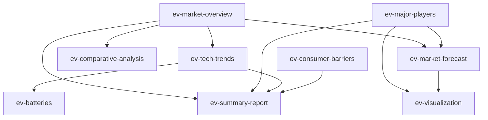
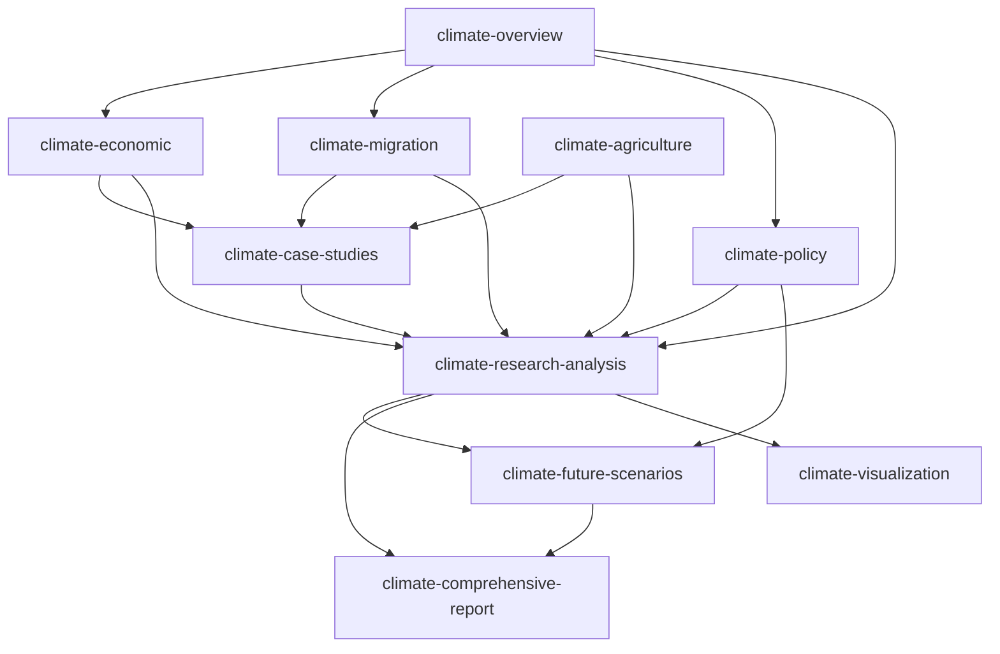
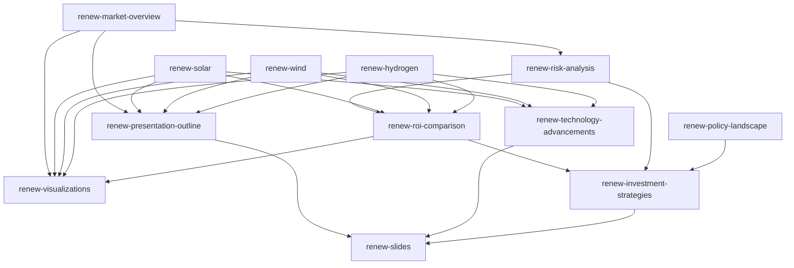
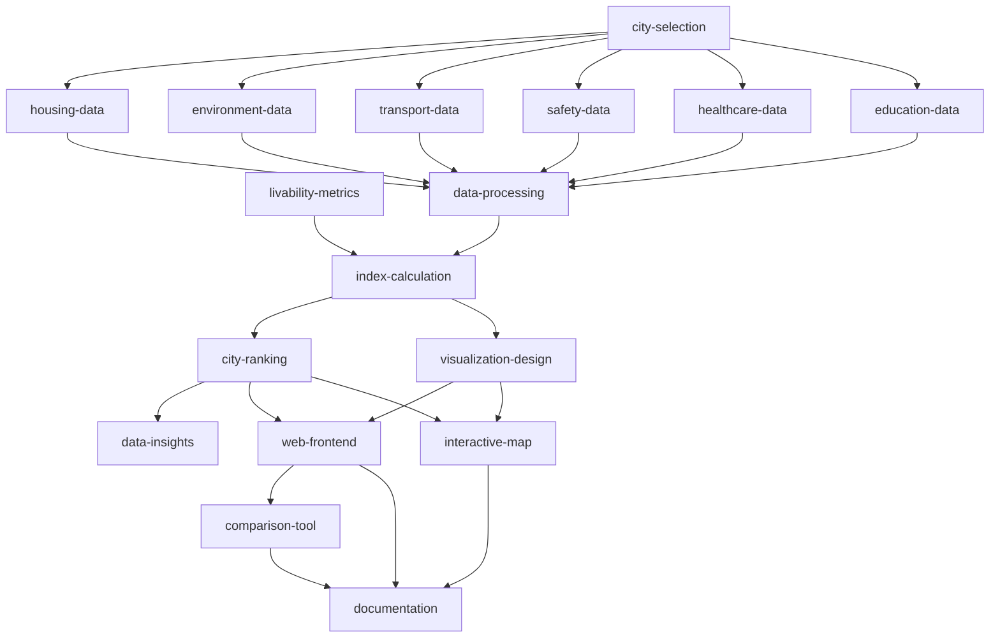

# Task Analysis Report: AI Workflow Agent Design

## Executive Summary

This report outlines the design and implementation of an advanced AI agent that can decompose user requirements into a workflow on a canvas with multiple nodes. The agent operates through epochs, maintaining a todo.md file to track task progress, and executes steps using different tools for research and generation capabilities.

## 1. Task Decomposition Overview

### 1.1. Core System Components

1. **Workflow Engine**
   - Responsible for decomposing user requirements into a DAG workflow
   - Manages epoch progression and task execution
   - Processes todo.md updates between epochs

2. **Canvas Management**
   - Handles the visualization of workflow as nodes on a canvas
   - Maintains relationships between nodes (parent-child connections)
   - Renders the DAG structure with proper connections

3. **Task Execution System**
   - Executes individual steps based on their tool type
   - Processes task results and updates task status
   - Maintains context between related steps

4. **Epoch Controller**
   - Manages progression through epochs
   - Determines when to advance to the next epoch
   - Finalizes the workflow when all tasks are complete

### 1.2. Primary Workflows

1. **Initial Requirement Analysis**
   - Parse user requirement
   - Generate initial todo.md
   - Create first epoch's tasks

2. **Epoch Execution**
   - Read current todo.md
   - Generate steps for current epoch
   - Execute steps in parallel or sequence
   - Collect results and update canvas

3. **Epoch Transition**
   - Generate summary findings
   - Update todo.md with completed tasks
   - Add new tasks if required
   - Determine if additional epochs are needed

4. **Workflow Completion**
   - Generate final summary
   - Ensure all nodes are properly connected
   - Create final visualization if needed

## 2. Schema Design

### 2.1. TodoSchema

```typescript
const todoSchema = z.object({
  originalRequest: z.string().describe('The original user request'),
  status: z.enum(['in_progress', 'completed']).describe('Overall status of the workflow'),
  completedTasks: z.array(
    z.object({
      id: z.string().describe('Unique identifier for the task'),
      description: z.string().describe('Description of the task'),
      completedInEpoch: z.number().describe('The epoch in which this task was completed'),
      findings: z.string().describe('Summary of findings from this task'),
      nodeIds: z.array(z.string()).describe('IDs of canvas nodes created for this task')
    })
  ),
  pendingTasks: z.array(
    z.object({
      id: z.string().describe('Unique identifier for the task'),
      description: z.string().describe('Description of the task'),
      priority: z.number().min(1).max(5).describe('Priority from 1 (highest) to 5 (lowest)'),
      dependencies: z.array(z.string()).optional().describe('IDs of tasks this depends on'),
      suggestedTool: z.enum(['commonQnA', 'webSearch', 'librarySearch', 'generateDoc', 'codeArtifacts'])
        .optional().describe('Suggested tool for this task'),
      stage: z.enum(['research', 'analysis', 'synthesis', 'creation'])
        .describe('The workflow stage this task belongs to - must follow proper sequencing: research (early) → analysis (middle) → synthesis (optional) → creation (final)')
    })
  ),
  currentEpoch: z.number().describe('The current epoch number'),
  maxEpoch: z.number().describe('The maximum number of epochs allowed'),
  summary: z.string().describe('Overall summary of findings so far')
});
```

### 2.2. WorkflowNodeSchema

Extending the existing `pilotStepSchema` from the pilot engine:

```typescript
const workflowNodeSchema = z
  .object({
    name: z.string().describe('A clear and concise title for the node'),
    skillName: z
      .enum(['commonQnA', 'webSearch', 'librarySearch', 'generateDoc', 'codeArtifacts'])
      .describe('The name of the skill to invoke'),
    query: z.string().describe('The query to ask the skill'),
    contextItemIds: z
      .array(z.string())
      .describe('The ID list of the relevant canvas items for this node'),
    parentIds: z
      .array(z.string())
      .describe('The IDs of parent nodes that this node builds upon'),
    goalCategory: z
      .enum(['research', 'synthesis', 'creation', 'analysis', 'verification'])
      .describe('The main purpose category of this node'),
    workflowStage: z
      .enum(['research', 'analysis', 'synthesis', 'creation'])
      .describe('The workflow stage this node belongs to, helps enforce proper tool sequencing'),
    priority: z
      .number()
      .min(1)
      .max(5)
      .describe('Priority level from 1 (highest) to 5 (lowest)'),
    todoTaskId: z
      .string()
      .describe('ID of the related task in todo.md'),
    position: z
      .object({
        x: z.number(),
        y: z.number()
      })
      .describe('Position on the canvas')
  })
  .describe('A single node in the workflow');
```

### 2.3. EpochSummarySchema

```typescript
const epochSummarySchema = z.object({
  epoch: z.number().describe('Epoch number'),
  completedSteps: z.array(z.string()).describe('IDs of steps completed in this epoch'),
  findings: z.string().describe('Summary of findings from this epoch'),
  todoUpdates: z.object({
    tasksCompleted: z.array(z.string()).describe('IDs of tasks completed'),
    tasksAdded: z.array(z.string()).describe('IDs of new tasks added'),
    tasksModified: z.array(z.string()).describe('IDs of tasks modified')
  }),
  nextSteps: z.string().describe('Recommended focus for the next epoch')
});
```

## 3. Prompt Designs

### 3.1. Todo.md Generation Prompt

```
# Todo.md Generation Agent

You are an advanced planning agent for complex research and creation tasks. Your job is to create and maintain a structured todo.md file that tracks all tasks needed to fulfill the user's request.

## Your Task

Analyze the user's request and generate a comprehensive todo.md file that:
1. Breaks down the overall request into specific, actionable tasks
2. Prioritizes tasks in a logical sequence
3. Identifies dependencies between tasks
4. Suggests appropriate tools for each task

## Available Tools and Sequencing Rules

1. **Research Stage (Early) - Priority 1-2**
   - **webSearch**: MUST use for web-based information retrieval
   - **librarySearch**: MUST use for knowledge base search
   - **commonQnA**: MUST use for general knowledge question answering

2. **Analysis Stage (Middle) - Priority 3**
   - **commonQnA**: MUST use for analyzing gathered information and providing structured insights
   - MUST NOT use generateDoc or codeArtifacts in this stage

3. **Synthesis Stage (Optional) - Priority 3-4**
   - **commonQnA**: MUST use for organizing information and planning final outputs
   - MUST NOT use generateDoc or codeArtifacts in this stage

4. **Creation Stage (Final) - Priority 4-5**
   - **generateDoc**: MUST use for comprehensive document generation
   - **codeArtifacts**: MUST use for code and visualization artifact generation
   - All visualizations MUST be produced as self-contained single-page HTML files

CRITICAL: Tasks MUST follow the proper sequence: research → analysis → synthesis → creation. NEVER skip stages. The generateDoc and codeArtifacts tools MUST ONLY be used in the final creation stage after sufficient context has been gathered through research and analysis.

## Format Requirements

The todo.md file should follow this structure:

```markdown
# Todo: [Brief description of overall goal]

## Original Request
[The user's original request]

## Status
[in_progress/completed]

## Current Epoch: [current epoch]/[max epoch]

## Tasks

### Completed
- [x] [task-id]: [Task description] (Completed in Epoch [number])
  - Findings: [Brief summary of findings]
  - Related Nodes: [List of node IDs on canvas]

### Pending
- [ ] [task-id]: [Task description] (Priority: [1-5])
  - Dependencies: [List of task IDs this depends on, if any]
  - Suggested Tool: [Tool name]
  - Stage: [research/analysis/synthesis/creation]

## Summary of Progress
[Brief summary of overall progress and key findings so far]
```

Your todo.md should be comprehensive yet focused on the most important aspects needed to fulfill the user's request.

CRITICAL SEQUENCING REQUIREMENT: Follow strict workflow stages:
1. Research first (webSearch, librarySearch, commonQnA for information gathering)
2. Analysis second (commonQnA for analyzing gathered information)
3. Synthesis optional (commonQnA for organizing and planning)
4. Creation last (generateDoc, codeArtifacts for final outputs)

NEVER use creation tools (generateDoc, codeArtifacts) without first completing sufficient research and analysis. All tasks MUST have the appropriate stage assigned and follow this sequence.
```

### 3.2. Epoch Planning Prompt

```
# Epoch Planning Agent

You are an epoch planning agent responsible for determining what tasks from the todo.md file should be executed in the current epoch.

## Your Task

Analyze the current todo.md file and determine which pending tasks should be executed in the current epoch. Your selection should:

1. Respect task dependencies (only select tasks whose dependencies are completed)
2. Consider task priorities (higher priority tasks should be selected first)
3. Group related tasks that would benefit from being executed together
4. Balance research tasks with analysis tasks
5. Limit selection to what can reasonably be accomplished in one epoch (max [N] tasks)

## Tool Sequencing Rules

1. **STRICTLY Follow Proper Task Sequencing**:
   - Research stage (early epochs): MUST use webSearch, librarySearch, commonQnA for information gathering
   - Analysis stage (middle epochs): MUST use commonQnA for analyzing gathered information
   - Synthesis stage (optional): MUST use commonQnA for organizing and planning outputs
   - Creation stage (final epochs): MUST ONLY use generateDoc and codeArtifacts after sufficient context gathering

2. **Context Requirements**:
   - Tasks using generateDoc or codeArtifacts MUST have dependencies on prior research and analysis tasks
   - Creation tasks MUST ONLY be scheduled when sufficient research and analysis has been completed
   - All codeArtifacts tasks MUST produce self-contained single-page HTML files when creating visualizations

3. **Output Format Guidelines**:
   - All tools can produce markdown text or code blocks for intermediate results
   - Final outputs should be comprehensive and integrate insights from research tasks

## Context

Current Epoch: [current epoch]/[max epoch]
Todo.md Content: [content of todo.md]
Previous Epochs Results: [summary of results from completed steps in previous epochs]

## Current Canvas State

Below is a Mermaid diagram representing the current state of the workflow canvas. 
Each node represents a completed step, with arrows indicating dependencies/relationships:

```mermaid
[mermaid_dag_representation]
```

Node details:
[
  {
    "id": "node-1",
    "name": "Step Name",
    "epoch": 1,
    "status": "completed"
  },
  ...
]

## Important Dependency Rule

Tasks in the current epoch MUST ONLY use context/results from PREVIOUS epochs, not from the current epoch. All node contexts must reference only nodes from earlier epochs.

## Output Format

Return a JSON array of tasks to be executed in this epoch, with each task object containing:
- id: The task ID from todo.md
- nodeTemplate: A template for the workflow node to be created, following the WorkflowNodeSchema
  - Ensure that contextItemIds and parentIds ONLY reference nodes from previous epochs
  - Assign proper workflowStage value based on the task's position in the workflow
  - For tasks using generateDoc or codeArtifacts, verify they have proper dependencies on research tasks
```

### 3.3. Todo.md Update Prompt

```
# Todo.md Update Agent

You are a task management agent responsible for updating the todo.md file based on the results of the most recent epoch.

## Your Task

Review the previous todo.md file and the results from the current epoch's steps. Update the todo.md file to:

1. Move completed tasks from "Pending" to "Completed"
2. Add summary findings for each completed task
3. Add references to canvas nodes created during task execution
4. Add any new tasks that have been identified based on the findings
5. Update the overall progress summary
6. Determine if the overall workflow is complete

## Tool Sequencing Guidelines

When updating the todo.md or adding new tasks, strictly follow these guidelines:

1. **Maintain Proper Workflow Progression**:
   - Early tasks should focus on research and context gathering (webSearch, librarySearch, commonQnA)
   - Middle tasks should focus on analysis of gathered information (commonQnA)
   - Final tasks should focus on synthesis and creation (generateDoc, codeArtifacts)

2. **For New Tasks**:
   - Assign appropriate 'stage' values: research, analysis, synthesis, or creation
   - Ensure generateDoc and codeArtifacts tasks have proper dependencies on research/analysis tasks
   - Maintain logical progression from research → analysis → creation
   
3. **Task Dependencies**:
   - Creation tasks MUST depend on analysis or research tasks
   - Analysis tasks should depend on research tasks
   - Complex tasks should build upon simpler, foundational tasks

## Context

Current Epoch: [current epoch]/[max epoch]
Previous Todo.md: [content of previous todo.md]
Epoch Results: [summary of steps executed in current epoch and their results]

## Output Format

Generate a new version of the todo.md file following the same structure as the previous one, but with appropriate updates based on the current epoch's results. Remember to maintain the stage field for all tasks and ensure proper sequencing.
```

### 3.4. Epoch Summary Prompt

```
# Epoch Summary Agent

You are a research synthesis agent responsible for creating a summary of findings from the current epoch.

## Your Task

Review all the steps executed in the current epoch and create a comprehensive summary that:

1. Distills the key findings across all steps
2. Identifies patterns, connections, and insights
3. Highlights any contradictions or areas needing further investigation
4. Provides recommendations for the next epoch's focus

## Workflow Progression Guidance

When providing recommendations for the next epoch, consider the current stage of the workflow:

1. **Research Stage Assessment**:
   - If the current epoch focused on research (webSearch, librarySearch), determine if sufficient context has been gathered
   - Recommend continuing research if critical information is still missing
   - Suggest transitioning to analysis once sufficient research has been completed

2. **Analysis Stage Assessment**:
   - If the current epoch focused on analysis (commonQnA), evaluate the depth of analysis
   - Recommend deeper analysis on specific topics if needed
   - Suggest transitioning to creation only when analysis is comprehensive enough to inform final outputs

3. **Creation Readiness Assessment**:
   - Explicitly state when the workflow is ready for final creation tasks (generateDoc, codeArtifacts)
   - Only recommend creation tasks when sufficient research and analysis have been completed
   - Ensure all necessary context for final outputs has been gathered

## Context

Current Epoch: [current epoch]/[max epoch]
Todo.md: [content of current todo.md]
Epoch Steps: [details of steps executed in the current epoch and their results]

## Output Format

Return a structured summary following the EpochSummarySchema that captures the most important findings and insights from this epoch. Include a clear assessment of workflow progression and recommendations for the appropriate next stage (continue research, move to analysis, or proceed to creation).
```

## 4. Example Workflow Scenarios

### 4.1. Market Research Workflow

**User Request:**
"I need to research the current state of the electric vehicle market, focusing on major players, technology trends, and consumer adoption barriers."

**Initial Todo.md:**
```markdown
# Todo: Electric Vehicle Market Research

## Original Request
I need to research the current state of the electric vehicle market, focusing on major players, technology trends, and consumer adoption barriers.

## Status
in_progress

## Current Epoch: 1/3

## Tasks

### Completed

### Pending
- [ ] ev-market-overview: Research overview of the global EV market (Priority: 1)
  - Suggested Tool: webSearch
- [ ] ev-major-players: Identify and analyze major EV manufacturers (Priority: 1)
  - Suggested Tool: webSearch
- [ ] ev-tech-trends: Research current and emerging technology trends in EVs (Priority: 2)
  - Dependencies: [ev-market-overview]
  - Suggested Tool: webSearch
- [ ] ev-batteries: Deep dive into battery technology advancements (Priority: 3)
  - Dependencies: [ev-tech-trends]
  - Suggested Tool: librarySearch
- [ ] ev-consumer-barriers: Analyze barriers to consumer adoption (Priority: 2)
  - Suggested Tool: webSearch
- [ ] ev-comparative-analysis: Compare traditional vehicles with EVs (Priority: 3)
  - Dependencies: [ev-market-overview]
  - Suggested Tool: commonQnA
- [ ] ev-market-forecast: Research forecasts for EV market growth (Priority: 3)
  - Dependencies: [ev-market-overview, ev-major-players]
  - Suggested Tool: webSearch
- [ ] ev-summary-report: Create comprehensive EV market report (Priority: 4)
  - Dependencies: [ev-market-overview, ev-major-players, ev-tech-trends, ev-consumer-barriers]
  - Suggested Tool: generateDoc
- [ ] ev-visualization: Generate market share visualization (Priority: 5)
  - Dependencies: [ev-major-players, ev-market-forecast]
  - Suggested Tool: codeArtifacts

## Summary of Progress
No progress has been made yet. The research plan has been created and tasks have been organized.
```

**Workflow DAG Description:**
- Starting nodes: ev-market-overview, ev-major-players, ev-consumer-barriers (executed in parallel)
- Second tier: ev-tech-trends (depends on ev-market-overview), ev-comparative-analysis (depends on ev-market-overview)
- Third tier: ev-batteries (depends on ev-tech-trends), ev-market-forecast (depends on ev-market-overview and ev-major-players)
- Final nodes: ev-summary-report (synthesis report), ev-visualization (creates visualization)

**Example Workflow DAG Visualization:**



### 4.2. Web Research and Comprehensive Analysis: Global Climate Change Impacts

**User Request:**
"I need to understand the impacts of global climate change on agriculture, economy, and population migration, and generate a comprehensive report."

**Initial Todo.md:**
```markdown
# Todo: Global Climate Change Impact Analysis

## Original Request
I need to understand the impacts of global climate change on agriculture, economy, and population migration, and generate a comprehensive report.

## Status
in_progress

## Current Epoch: 1/3

## Tasks

### Completed

### Pending
- [ ] climate-overview: Research basic overview and latest data on global climate change (Priority: 1)
  - Suggested Tool: webSearch
  - Stage: research
- [ ] climate-agriculture: Research the impact of climate change on global agriculture (Priority: 1)
  - Suggested Tool: webSearch
  - Stage: research
- [ ] climate-economic: Analyze the economic impacts of climate change globally (Priority: 2)
  - Dependencies: [climate-overview]
  - Suggested Tool: webSearch
  - Stage: research
- [ ] climate-migration: Research climate-induced population migration patterns (Priority: 2)
  - Dependencies: [climate-overview]
  - Suggested Tool: webSearch
  - Stage: research
- [ ] climate-policy: Analyze global climate policies and mitigation measures (Priority: 3)
  - Dependencies: [climate-overview]
  - Suggested Tool: webSearch
  - Stage: research
- [ ] climate-case-studies: Collect case studies from specific countries and regions (Priority: 3)
  - Dependencies: [climate-agriculture, climate-economic, climate-migration]
  - Suggested Tool: librarySearch
  - Stage: research
- [ ] climate-research-analysis: Analyze and synthesize all collected research data (Priority: 3)
  - Dependencies: [climate-overview, climate-agriculture, climate-economic, climate-migration, climate-policy, climate-case-studies]
  - Suggested Tool: commonQnA
  - Stage: analysis
- [ ] climate-future-scenarios: Predict future climate change scenarios and their impacts (Priority: 3)
  - Dependencies: [climate-overview, climate-policy, climate-research-analysis]
  - Suggested Tool: commonQnA
  - Stage: analysis
- [ ] climate-comprehensive-report: Create a comprehensive report on climate change impacts (Priority: 4)
  - Dependencies: [climate-research-analysis, climate-future-scenarios]
  - Suggested Tool: generateDoc
  - Stage: creation
- [ ] climate-visualization: Generate visualization of key data (Priority: 4)
  - Dependencies: [climate-research-analysis]
  - Suggested Tool: codeArtifacts
  - Stage: creation

## Summary of Progress
No progress has been made yet. The research plan has been created and tasks have been organized.
```

**Workflow DAG Description:**
- **Epoch 1 (Research)**: climate-overview, climate-agriculture (executed in parallel)
- **Epoch 2 (Research)**: climate-economic, climate-migration (depend on climate-overview), climate-policy (depends on climate-overview)
- **Epoch 3 (Research & Analysis)**: climate-case-studies (depends on multiple parent nodes), climate-research-analysis (depends on all research nodes)
- **Epoch 4 (Analysis)**: climate-future-scenarios (depends on climate-overview, climate-policy, and climate-research-analysis)
- **Epoch 5 (Creation)**: climate-comprehensive-report (synthesis report, depends on analysis nodes), climate-visualization (creates visualizations, depends on analysis)

Note how the workflow properly sequences tasks from research → analysis → creation, with generateDoc and codeArtifacts only used in the final epoch after sufficient context has been gathered.

**Example Workflow DAG Visualization:**



The visualization shows how this workflow properly enforces tool sequencing, with research tools used first, analysis in the middle, and creation tools only at the end after sufficient context has been gathered.

### 4.3. Deep Research and Presentation Creation: Renewable Energy Investment Opportunities

**User Request:**
"Research global renewable energy investment opportunities, especially focusing on growth projections, key companies, and technological advancements in solar, wind, and hydrogen sectors, and create a professional PowerPoint presentation for potential investors."

**Initial Todo.md:**
```markdown
# Todo: Renewable Energy Investment Opportunities Research and Presentation

## Original Request
Research global renewable energy investment opportunities, especially focusing on growth projections, key companies, and technological advancements in solar, wind, and hydrogen sectors, and create a professional PowerPoint presentation for potential investors.

## Status
in_progress

## Current Epoch: 1/3

## Tasks

### Completed

### Pending
- [ ] renew-market-overview: Research overall renewable energy market and investment trends (Priority: 1)
  - Suggested Tool: webSearch
- [ ] renew-solar: Deep dive into solar energy industry investment opportunities and key companies (Priority: 1)
  - Suggested Tool: webSearch
- [ ] renew-wind: Deep dive into wind energy industry investment opportunities and key companies (Priority: 1)
  - Suggested Tool: webSearch
- [ ] renew-hydrogen: Deep dive into hydrogen energy industry investment opportunities and key companies (Priority: 2)
  - Suggested Tool: webSearch
- [ ] renew-technology-advancements: Research latest technological advancements in each sector (Priority: 2)
  - Dependencies: [renew-solar, renew-wind, renew-hydrogen]
  - Suggested Tool: librarySearch
- [ ] renew-risk-analysis: Analyze risks and challenges of renewable energy investments (Priority: 2)
  - Dependencies: [renew-market-overview]
  - Suggested Tool: commonQnA
- [ ] renew-policy-landscape: Research global renewable energy policies and subsidies (Priority: 3)
  - Suggested Tool: webSearch
- [ ] renew-roi-comparison: Compare projected returns on investment for different renewable energy sectors (Priority: 3)
  - Dependencies: [renew-solar, renew-wind, renew-hydrogen, renew-risk-analysis]
  - Suggested Tool: commonQnA
- [ ] renew-investment-strategies: Formulate investment strategy recommendations for renewable energy (Priority: 4)
  - Dependencies: [renew-market-overview, renew-risk-analysis, renew-roi-comparison, renew-policy-landscape]
  - Suggested Tool: commonQnA
- [ ] renew-presentation-outline: Create detailed outline for the presentation (Priority: 4)
  - Dependencies: [renew-market-overview, renew-solar, renew-wind, renew-hydrogen]
  - Suggested Tool: generateDoc
- [ ] renew-slides: Generate complete PowerPoint presentation (Priority: 5)
  - Dependencies: [renew-presentation-outline, renew-investment-strategies, renew-technology-advancements]
  - Suggested Tool: codeArtifacts
- [ ] renew-visualizations: Create compelling data visualizations for the presentation (Priority: 4)
  - Dependencies: [renew-market-overview, renew-solar, renew-wind, renew-hydrogen, renew-roi-comparison]
  - Suggested Tool: codeArtifacts

## Summary of Progress
No progress has been made yet. The research plan has been created and tasks have been organized.
```

**Workflow DAG Description:**
- Starting nodes: renew-market-overview, renew-solar, renew-wind, renew-hydrogen, renew-policy-landscape (executed in parallel)
- Second tier: renew-technology-advancements (depends on three energy research tasks), renew-risk-analysis (depends on market overview)
- Third tier: renew-roi-comparison (depends on multiple parent nodes)
- Fourth tier: renew-investment-strategies (depends on multiple parent nodes), renew-presentation-outline (depends on basic research)
- Fifth tier: renew-visualizations (depends on key data sources), renew-slides (final presentation)

**Example Workflow DAG Visualization:**



### 4.4. Interactive Data Visualization: Global City Livability Index

**User Request:**
"I need to research the livability index of 50 major global cities, including factors like housing costs, environmental quality, transportation, safety, healthcare, and education, and create an interactive webpage that allows users to compare scores and rankings across different cities."

**Initial Todo.md:**
```markdown
# Todo: Global City Livability Index Interactive Visualization Webpage

## Original Request
I need to research the livability index of 50 major global cities, including factors like housing costs, environmental quality, transportation, safety, healthcare, and education, and create an interactive webpage that allows users to compare scores and rankings across different cities.

## Status
in_progress

## Current Epoch: 1/4

## Tasks

### Completed

### Pending
- [ ] city-selection: Determine the 50 major cities to research (Priority: 1)
  - Suggested Tool: webSearch
- [ ] livability-metrics: Define key metrics and weights for livability assessment (Priority: 1)
  - Suggested Tool: commonQnA
- [ ] housing-data: Gather housing cost data for selected cities (Priority: 2)
  - Dependencies: [city-selection]
  - Suggested Tool: webSearch
- [ ] environment-data: Gather environmental quality data for selected cities (Priority: 2)
  - Dependencies: [city-selection]
  - Suggested Tool: webSearch
- [ ] transport-data: Gather transportation convenience data for selected cities (Priority: 2)
  - Dependencies: [city-selection]
  - Suggested Tool: webSearch
- [ ] safety-data: Gather safety index data for selected cities (Priority: 2)
  - Dependencies: [city-selection]
  - Suggested Tool: webSearch
- [ ] healthcare-data: Gather healthcare quality data for selected cities (Priority: 2)
  - Dependencies: [city-selection]
  - Suggested Tool: webSearch
- [ ] education-data: Gather education quality data for selected cities (Priority: 2)
  - Dependencies: [city-selection]
  - Suggested Tool: webSearch
- [ ] data-processing: Process and standardize all collected data (Priority: 3)
  - Dependencies: [housing-data, environment-data, transport-data, safety-data, healthcare-data, education-data]
  - Suggested Tool: codeArtifacts
- [ ] index-calculation: Calculate comprehensive livability index for each city (Priority: 3)
  - Dependencies: [data-processing, livability-metrics]
  - Suggested Tool: codeArtifacts
- [ ] city-ranking: Rank cities based on livability indices (Priority: 3)
  - Dependencies: [index-calculation]
  - Suggested Tool: codeArtifacts
- [ ] data-insights: Analyze key trends and insights into city livability (Priority: 4)
  - Dependencies: [city-ranking]
  - Suggested Tool: commonQnA
- [ ] visualization-design: Design interactive visualization interface (Priority: 4)
  - Dependencies: [index-calculation]
  - Suggested Tool: generateDoc
- [ ] web-frontend: Create interactive webpage frontend (Priority: 5)
  - Dependencies: [visualization-design, city-ranking]
  - Suggested Tool: codeArtifacts
- [ ] interactive-map: Create interactive map of city livability (Priority: 5)
  - Dependencies: [city-ranking, visualization-design]
  - Suggested Tool: codeArtifacts
- [ ] comparison-tool: Implement city comparison functionality (Priority: 5)
  - Dependencies: [web-frontend]
  - Suggested Tool: codeArtifacts
- [ ] documentation: Create project documentation and user guide (Priority: 5)
  - Dependencies: [web-frontend, interactive-map, comparison-tool]
  - Suggested Tool: generateDoc

## Summary of Progress
No progress has been made yet. The research plan has been created and tasks have been organized.
```

**Workflow DAG Description:**
- Starting nodes: city-selection, livability-metrics (executed in parallel)
- Second tier: housing-data, environment-data, transport-data, safety-data, healthcare-data, education-data (all data collection tasks in parallel, all dependent on city-selection)
- Third tier: data-processing (depends on all data collection tasks)
- Fourth tier: index-calculation (depends on data-processing and livability-metrics)
- Fifth tier: city-ranking (depends on index-calculation), visualization-design (depends on index-calculation)
- Sixth tier: data-insights (depends on city-ranking)
- Seventh tier: web-frontend, interactive-map (depend on visualization-design and city-ranking)
- Eighth tier: comparison-tool (depends on web-frontend)
- Final node: documentation (depends on all UI components)

**Example Workflow DAG Visualization:**



This visualization demonstrates how a complex research and development task can be broken down into a structured workflow with clear dependencies, allowing the AI agent to methodically progress through the required steps while maintaining a coherent path toward the final goal.

## 5. Tool Usage Guidelines

### 5.1. Tool Purpose and Sequence

The workflow agent uses different tools for various stages of the task. Following proper sequencing ensures optimal results:

1. **Research and Context Gathering Tools (Early to Mid Stages)**
   - **webSearch**: Primary tool for gathering up-to-date information from the internet
   - **librarySearch**: Used for searching through structured knowledge bases
   - **commonQnA**: Leverages general knowledge for analysis and basic information

2. **Analysis and Intermediate Output Tools (Mid Stages)**
   - **commonQnA**: Analyzes gathered information and provides structured insights
   - All tools can produce intermediate outputs as markdown text or code blocks
   - Markdown code blocks are rendered by the frontend and can present data visualizations

3. **Final Output Generation Tools (Final Stages)**
   - **generateDoc**: Creates comprehensive documents, reports, or presentations based on previous research
   - **codeArtifacts**: Generates complete code artifacts, visualizations, or interactive components

### 5.2. Tool Usage Rules

1. **Early and Mid-Stage Context Gathering**
   - Always prioritize search tools (webSearch, librarySearch) or commonQnA for obtaining necessary context
   - Build a solid information foundation before moving to synthesis or creation tasks
   - Document findings thoroughly as they will inform later stages

2. **Synthesis and Creation Sequencing**
   - **generateDoc** and **codeArtifacts** should be used in final or late stages only
   - These tools should depend on previously researched context
   - Never use these tools in initial epochs without proper context from earlier tools

3. **Intermediate Presentation**
   - Use markdown formatting for intermediate outputs from any tool
   - Leverage code blocks (```language) for presenting code, data, or visualizations
   - Remember that frontend will render these code blocks appropriately

4. **Data Flow and Dependencies**
   - Ensure each node has proper parent connections to maintain knowledge flow
   - Synthesis nodes must reference all relevant research nodes
   - Final output nodes should integrate insights from multiple parent nodes

### 5.3. Common Workflows

**Correct Sequence:**
Research (webSearch/librarySearch) → Analysis (commonQnA) → Synthesis (commonQnA) → Final Output (generateDoc/codeArtifacts)

**Incorrect Sequence:**
Starting with generateDoc without prior research → Creating code artifacts without necessary context

## 6. Implementation Details

### 6.1. Core Service Structure

The implementation will build upon the existing `PilotEngine` with additional components for handling todo.md:

```typescript
export class WorkflowAgent {
  private logger = new Logger(WorkflowAgent.name);

  constructor(
    private readonly model: BaseChatModel,
    private readonly session: PilotSession,
    private readonly steps: PilotStep[],
    private readonly todoMdService: TodoMdService,
  ) {}

  // Initialize workflow by generating initial todo.md
  async initialize(userRequest: string, maxEpochs: number): Promise<string> {
    return this.todoMdService.generateInitialTodo(userRequest, maxEpochs);
  }

  // Plan steps for current epoch based on todo.md
  async planEpoch(todoMd: string): Promise<WorkflowNodeRawOutput[]> {
    // Get only previous epochs' results to use as context
    const previousEpochsResults = await this.getPreviousEpochsResults();
    
    // Generate canvas state as Mermaid diagram for planning context
    const canvasState = await this.generateCanvasStateDiagram();
    
    const nodes = await this.todoMdService.planEpochSteps(
      todoMd, 
      previousEpochsResults,
      canvasState
    );
    
    // Validate that all node context references are to previous epochs
    this.validateNodeContextReferences(nodes);
    
    return nodes;
  }

  // Generate Mermaid diagram of current canvas state
  private async generateCanvasStateDiagram(): Promise<{
    mermaidDiagram: string;
    nodeDetails: Array<{
      id: string;
      name: string;
      epoch: number;
      status: string;
    }>;
  }> {
    // Get all completed steps from previous epochs
    const previousSteps = this.steps.filter(step => 
      step.epochNumber < this.session.currentEpoch && 
      step.status === 'completed'
    );
    
    // Generate node details
    const nodeDetails = previousSteps.map(step => ({
      id: step.nodeId,
      name: step.name,
      epoch: step.epochNumber,
      status: step.status
    }));
    
    // Generate Mermaid diagram
    let mermaidCode = 'graph TD\n';
    
    // Add nodes
    for (const step of previousSteps) {
      mermaidCode += `    ${step.nodeId}["${step.name}"]\n`;
    }
    
    // Add edges (connections between nodes)
    for (const step of previousSteps) {
      if (step.parentIds && step.parentIds.length > 0) {
        // Convert string of parentIds to array if needed
        const parentIdsArray = typeof step.parentIds === 'string' 
          ? JSON.parse(step.parentIds) 
          : step.parentIds;
          
        for (const parentId of parentIdsArray) {
          mermaidCode += `    ${parentId} --> ${step.nodeId}\n`;
        }
      }
    }
    
    return {
      mermaidDiagram: mermaidCode,
      nodeDetails
    };
  }

  // Get results from all previous epochs
  private async getPreviousEpochsResults(): Promise<{ nodeId: string; result: any }[]> {
    const currentEpoch = this.session.currentEpoch;
    
    // Filter completed steps from previous epochs
    const previousEpochsSteps = this.steps.filter(step => 
      step.epochNumber < currentEpoch && step.status === 'completed'
    );
    
    // Return their results in a structured format
    return previousEpochsSteps.map(step => ({
      nodeId: step.nodeId,
      result: step.result
    }));
  }
  
  // Validate that nodes only reference previous epoch nodes
  private validateNodeContextReferences(nodes: WorkflowNodeRawOutput[]): void {
    // Get all nodeIds from previous epochs
    const previousEpochNodeIds = this.steps
      .filter(step => step.epochNumber < this.session.currentEpoch)
      .map(step => step.nodeId);
      
    // Check each node's context references
    for (const node of nodes) {
      // Validate contextItemIds
      if (node.nodeTemplate.contextItemIds) {
        for (const contextId of node.nodeTemplate.contextItemIds) {
          if (!previousEpochNodeIds.includes(contextId)) {
            this.logger.warn(`Node ${node.id} references invalid context: ${contextId}`);
            // Remove invalid references
            node.nodeTemplate.contextItemIds = node.nodeTemplate.contextItemIds
              .filter(id => previousEpochNodeIds.includes(id));
          }
        }
      }
      
      // Validate parentIds
      if (node.nodeTemplate.parentIds) {
        for (const parentId of node.nodeTemplate.parentIds) {
          if (!previousEpochNodeIds.includes(parentId)) {
            this.logger.warn(`Node ${node.id} references invalid parent: ${parentId}`);
            // Remove invalid references
            node.nodeTemplate.parentIds = node.nodeTemplate.parentIds
              .filter(id => previousEpochNodeIds.includes(id));
          }
        }
      }
    }
  }

  // Execute epoch steps (similar to existing PilotEngine.run)
  async executeEpoch(nodes: WorkflowNodeRawOutput[]): Promise<ActionResult[]> {
    // Implementation similar to PilotEngine.run
    // Important: When executing steps, only allow access to context from previous epochs
  }

  // Update todo.md after epoch completion
  async updateTodo(todoMd: string, epochResults: ActionResult[]): Promise<string> {
    return this.todoMdService.updateTodoMd(todoMd, epochResults, this.session);
  }

  // Generate epoch summary
  async generateEpochSummary(todoMd: string, epochResults: ActionResult[]): Promise<EpochSummary> {
    return this.todoMdService.generateEpochSummary(todoMd, epochResults, this.session);
  }

  // Check if workflow is complete
  isWorkflowComplete(todoMd: string): boolean {
    return this.todoMdService.isWorkflowComplete(todoMd) || 
           this.session.currentEpoch >= this.session.maxEpoch;
  }
}
```

### 6.2. TodoMdService

```typescript
export class TodoMdService {
  private logger = new Logger(TodoMdService.name);
  
  constructor(private readonly model: BaseChatModel) {}

  // Generate initial todo.md
  async generateInitialTodo(userRequest: string, maxEpochs: number): Promise<string> {
    // Implementation using the todo.md generation prompt
  }

  // Plan steps for the current epoch
  async planEpochSteps(
    todoMd: string, 
    previousEpochsResults: any[],
    canvasState: {
      mermaidDiagram: string;
      nodeDetails: Array<{
        id: string;
        name: string;
        epoch: number;
        status: string;
      }>;
    }
  ): Promise<WorkflowNodeRawOutput[]> {
    // Implementation using the epoch planning prompt
    // Include canvas state diagram for better visualization
    
    const prompt = `
      # Epoch Planning Agent
      
      You are an epoch planning agent responsible for determining what tasks from the todo.md file should be executed in the current epoch.
      
      ## Your Task
      
      Analyze the current todo.md file and determine which pending tasks should be executed in the current epoch.
      
      ## Context
      
      Current Epoch: ${session.currentEpoch}/${session.maxEpoch}
      Todo.md Content: ${todoMd}
      Previous Epochs Results: ${JSON.stringify(previousEpochsResults, null, 2)}
      
      ## Current Canvas State
      
      Below is a Mermaid diagram representing the current state of the workflow canvas:
      
      \`\`\`mermaid
      ${canvasState.mermaidDiagram}
      \`\`\`
      
      Node details:
      ${JSON.stringify(canvasState.nodeDetails, null, 2)}
      
      ## Important Dependency Rule
      
      Tasks in the current epoch MUST ONLY use context/results from PREVIOUS epochs, not from the current epoch.
      All node contexts must reference only nodes from earlier epochs.
      
      ## Output Format
      
      Return a JSON array of tasks to be executed in this epoch.
    `;
    
    // Call model with prompt and process response
    const response = await this.model.call(prompt);
    return this.parseEpochPlanningResponse(response);
  }

  private parseEpochPlanningResponse(response: string): WorkflowNodeRawOutput[] {
    // Parse and validate model's JSON response
    try {
      // Extract JSON from response if needed
      const jsonMatch = response.match(/```json\n([\s\S]*?)```/) || 
                         response.match(/```\n([\s\S]*?)```/) ||
                         [null, response];
      
      const jsonString = jsonMatch[1].trim();
      const parsedResponse = JSON.parse(jsonString);
      
      // Validate the parsed response
      return parsedResponse.map(item => ({
        id: item.id,
        nodeTemplate: {
          ...item.nodeTemplate,
          // Ensure contextItemIds and parentIds are arrays
          contextItemIds: Array.isArray(item.nodeTemplate.contextItemIds) 
            ? item.nodeTemplate.contextItemIds 
            : [],
          parentIds: Array.isArray(item.nodeTemplate.parentIds)
            ? item.nodeTemplate.parentIds
            : []
        }
      }));
    } catch (error) {
      this.logger.error(`Failed to parse epoch planning response: ${error.message}`);
      throw new Error('Invalid planning response format');
    }
  }

  // Update todo.md after epoch completion
  async updateTodoMd(todoMd: string, epochResults: ActionResult[], session: PilotSession): Promise<string> {
    // Implementation using the todo.md update prompt
  }

  // Generate epoch summary
  async generateEpochSummary(todoMd: string, epochResults: ActionResult[], session: PilotSession): Promise<EpochSummary> {
    // Implementation using the epoch summary prompt
  }

  // Check if workflow is complete
  isWorkflowComplete(todoMd: string): boolean {
    // Parse todo.md and check if status is "completed"
  }
}
```

### 6.3. WorkflowController

```typescript
@Controller('workflow')
export class WorkflowController {
  constructor(private workflowService: WorkflowService) {}

  @Post()
  async createWorkflow(@Body() request: CreateWorkflowRequest, @CurrentUser() user: User) {
    return this.workflowService.createWorkflow(user, request);
  }

  @Get(':workflowId')
  async getWorkflow(@Param('workflowId') workflowId: string, @CurrentUser() user: User) {
    return this.workflowService.getWorkflow(user, workflowId);
  }

  @Get(':workflowId/todo')
  async getWorkflowTodo(@Param('workflowId') workflowId: string, @CurrentUser() user: User) {
    return this.workflowService.getWorkflowTodo(user, workflowId);
  }

  @Get(':workflowId/epochs/:epochNumber/summary')
  async getEpochSummary(
    @Param('workflowId') workflowId: string,
    @Param('epochNumber') epochNumber: number,
    @CurrentUser() user: User,
  ) {
    return this.workflowService.getEpochSummary(user, workflowId, epochNumber);
  }
}
```

## 7. Future Enhancements

1. **User Intervention**
   - Allow users to manually edit todo.md
   - Implement approval steps between epochs
   - Enable custom task addition

2. **Adaptive Workflow**
   - Dynamically adjust maxEpochs based on task complexity
   - Implement task reprioritization based on findings
   - Add support for rollback/retry of failed steps

3. **Visual Enhancements**
   - Improve node positioning algorithm
   - Add color coding by task type
   - Implement automatic layout optimization

4. **Advanced Metrics**
   - Track task completion time
   - Measure information gain per step
   - Evaluate workflow efficiency

5. **Tool Extension**
   - Add support for more specialized tools
   - Implement tool-specific parameter configuration
   - Enable custom tool integration

## 8. Conclusion

The design outlined in this report provides a comprehensive framework for implementing an agent that can decompose user requirements into a workflow on a canvas with multiple interconnected nodes. By extending the existing PilotEngine and incorporating todo.md-based task management, the system can maintain a structured approach to complex tasks across multiple epochs.

The workflow agent manages the entire lifecycle from initial requirement analysis through multiple research and creation phases to final output generation. The todo.md file serves as a persistent record of task status and findings, allowing for transparent tracking of progress and clear identification of next steps.